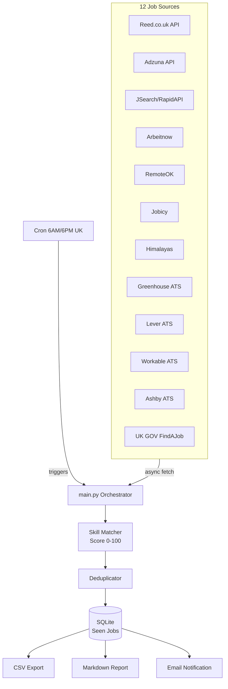

# Job360

Automated UK job search system that aggregates AI/ML jobs from 12 sources every 12 hours and emails new matching jobs with apply links.

## Architecture



## Features

- **12 job sources**: 3 keyed APIs (Reed, Adzuna, JSearch) + 4 free APIs (Arbeitnow, RemoteOK, Jobicy, Himalayas) + 4 ATS boards (Greenhouse, Lever, Workable, Ashby monitoring 80+ companies) + UK GOV FindAJob
- **Smart scoring**: Jobs scored 0-100 against your CV profile (title match 40pts, skill match 40pts, location 10pts, recency 10pts)
- **Visa flagging**: Automatically flags jobs mentioning visa/sponsorship
- **Deduplication**: Same job from different sources merged by normalised company+title
- **Persistent tracking**: SQLite database prevents duplicate notifications
- **Email digest**: HTML email with top jobs, scores, and clickable apply links
- **CSV exports**: Full job data exported per run
- **Markdown reports**: Ranked job tables saved locally
- **Cron scheduling**: Runs at 6AM and 6PM UK time automatically

## Quick Start

```bash
# 1. Clone and setup
git clone https://github.com/Ranjith36963/job360.git
cd job360
bash setup.sh

# 2. Configure API keys
nano .env

# 3. Run
source venv/bin/activate
python src/main.py

# 4. Schedule (optional)
bash cron_setup.sh
```

## API Key Setup

| Source | Signup | ENV Variable |
|--------|--------|-------------|
| Reed.co.uk | [reed.co.uk/developers](https://www.reed.co.uk/developers/jobseeker) | `REED_API_KEY` |
| Adzuna | [developer.adzuna.com](https://developer.adzuna.com/) | `ADZUNA_APP_ID`, `ADZUNA_APP_KEY` |
| JSearch | [rapidapi.com/jsearch](https://rapidapi.com/letscrape-6bRBa3QguO5/api/jsearch) | `JSEARCH_API_KEY` |
| Gmail | [Google App Passwords](https://myaccount.google.com/apppasswords) | `SMTP_EMAIL`, `SMTP_PASSWORD`, `NOTIFY_EMAIL` |

**Free sources (no key needed)**: Arbeitnow, RemoteOK, Jobicy, Himalayas, Greenhouse, Lever, Workable, Ashby, FindAJob

The system works without any API keys - it will skip keyed sources and fetch from the 9 free sources.

## Scoring Algorithm

| Component | Points | How |
|-----------|--------|-----|
| Title match | 0-40 | Exact match to target titles (AI Engineer, ML Engineer, etc.) |
| Skill match | 0-40 | Primary skills (Python, PyTorch, LangChain) = 3pts, Secondary (Docker, AWS) = 2pts, Tertiary = 1pt |
| Location | 0-10 | UK/London/specified locations = 10, Remote = 8 |
| Recency | 0-10 | Based on posting date |

## Configuration

Edit `src/config/keywords.py` to customise:
- `JOB_TITLES` - Job titles to search for
- `PRIMARY_SKILLS` / `SECONDARY_SKILLS` / `TERTIARY_SKILLS` - Skills to match with weights
- `LOCATIONS` - Target locations

Edit `src/config/companies.py` to customise:
- `GREENHOUSE_COMPANIES` - Companies to monitor on Greenhouse (~40 companies)
- `LEVER_COMPANIES` - Companies to monitor on Lever (~20 companies)
- `WORKABLE_COMPANIES` / `ASHBY_COMPANIES` - Additional ATS boards

## Project Structure

```
job360/
├── src/
│   ├── main.py              # Central orchestrator
│   ├── models.py             # Job dataclass
│   ├── config/
│   │   ├── settings.py       # Env vars, constants
│   │   ├── keywords.py       # Job titles, skills, locations
│   │   └── companies.py      # ATS company slugs
│   ├── sources/
│   │   ├── base.py           # Abstract base with retry/rate-limit
│   │   ├── reed.py           # Reed.co.uk API
│   │   ├── adzuna.py         # Adzuna API
│   │   ├── jsearch.py        # JSearch/RapidAPI
│   │   ├── arbeitnow.py      # Arbeitnow (free)
│   │   ├── remoteok.py       # RemoteOK (free)
│   │   ├── jobicy.py         # Jobicy (free)
│   │   ├── himalayas.py      # Himalayas (free)
│   │   ├── greenhouse.py     # Greenhouse ATS boards
│   │   ├── lever.py          # Lever ATS boards
│   │   ├── workable.py       # Workable ATS boards
│   │   ├── ashby.py          # Ashby ATS boards
│   │   └── findajob.py       # UK GOV FindAJob RSS
│   ├── filters/
│   │   ├── skill_matcher.py  # Scoring engine (0-100)
│   │   └── deduplicator.py   # Cross-source dedup
│   ├── notifications/
│   │   ├── email_notify.py   # SMTP/Gmail email sender
│   │   └── report_generator.py  # Markdown + HTML reports
│   ├── storage/
│   │   ├── database.py       # Async SQLite
│   │   └── csv_export.py     # CSV export
│   └── utils/
│       ├── logger.py         # Logging config
│       └── rate_limiter.py   # Async rate limiter
├── tests/                    # Full test suite
├── data/                     # Exports, reports, logs (gitignored)
├── requirements.txt
├── .env.example
├── setup.sh
└── cron_setup.sh
```

## Testing

```bash
python -m pytest tests/ -v
```

## Output

Each run produces:
- **CSV file**: `data/exports/jobs_YYYYMMDD_HHMMSS.csv`
- **Markdown report**: `data/reports/report_YYYYMMDD_HHMMSS.md`
- **Email**: HTML digest with top jobs and apply links
- **Console**: Summary of new jobs found
- **Logs**: `data/logs/job360.log`
