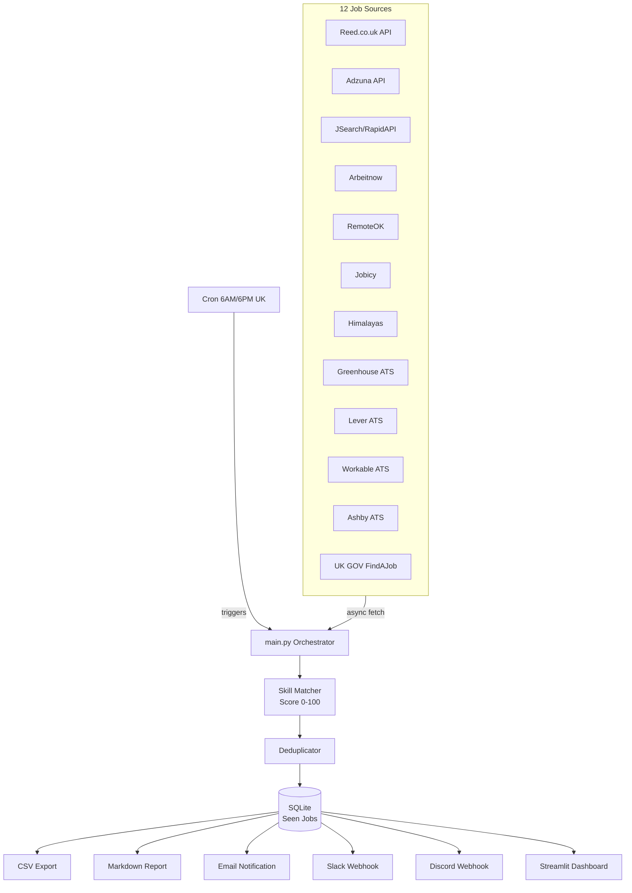

# Job360

Automated UK job search system that aggregates AI/ML jobs from 12 sources, scores them against your CV profile, and delivers results via email, Slack, Discord, and a web dashboard.

## Architecture



## What's Done

- **12 job sources** — all implemented and tested:
  - 3 keyed APIs: Reed, Adzuna, JSearch (skip gracefully if no API key)
  - 4 free APIs: Arbeitnow, RemoteOK, Jobicy, Himalayas
  - 4 ATS boards: Greenhouse (20 companies), Lever (5 companies), Workable (4 companies), Ashby (6 companies) — 35 companies total
  - 1 government: UK GOV FindAJob RSS
- **Smart scoring** — jobs scored 0-100 against your CV profile (title 40pts + skills 40pts + location 10pts + recency 10pts)
- **Visa flagging** — automatically flags jobs mentioning visa/sponsorship keywords
- **Deduplication** — same job from different sources merged by normalised company+title
- **Persistent tracking** — SQLite database prevents duplicate notifications across runs
- **Email digest** — HTML email with top jobs, scores, and clickable apply links
- **Slack notifications** — rich Block Kit message with top 10 jobs via webhook
- **Discord notifications** — embed message with top 10 jobs via webhook
- **Streamlit dashboard** — interactive web UI with filters, charts, score distribution, source breakdown, run history, and CSV export
- **CSV exports** — full job data exported per run
- **Markdown reports** — ranked job tables saved locally
- **Recency scoring** — recent jobs (0-1 days) get full 10pts, older jobs score less, 7+ days get 0pts
- **Cron scheduling** — validated `cron_setup.sh` with tests (6AM/6PM UK time, Europe/London timezone)
- **90 tests passing** — full test suite covering all sources, scoring (including recency tiers), dedup, storage, notifications, cron validation, and integration

## What's Not Done Yet

- **Live job search** — the system hasn't been run against real APIs yet (tested with mocks only)

## Quick Start

```bash
# 1. Clone and setup
git clone https://github.com/Ranjith36963/enterprise-mcp-hub.git
cd enterprise-mcp-hub
bash setup.sh

# 2. Configure API keys
nano .env

# 3. Run job search
source venv/bin/activate
python src/main.py

# 4. Launch dashboard
streamlit run src/dashboard.py

# 5. Schedule (optional)
bash cron_setup.sh
```

## API Key Setup

| Source | Signup | ENV Variable |
|--------|--------|-------------|
| Reed.co.uk | [reed.co.uk/developers](https://www.reed.co.uk/developers/jobseeker) | `REED_API_KEY` |
| Adzuna | [developer.adzuna.com](https://developer.adzuna.com/) | `ADZUNA_APP_ID`, `ADZUNA_APP_KEY` |
| JSearch | [rapidapi.com/jsearch](https://rapidapi.com/letscrape-6bRBa3QguO5/api/jsearch) | `JSEARCH_API_KEY` |
| Gmail | [Google App Passwords](https://myaccount.google.com/apppasswords) | `SMTP_EMAIL`, `SMTP_PASSWORD`, `NOTIFY_EMAIL` |
| Slack | [Slack Webhooks](https://api.slack.com/messaging/webhooks) | `SLACK_WEBHOOK_URL` |
| Discord | [Discord Webhooks](https://discord.com/developers/docs/resources/webhook) | `DISCORD_WEBHOOK_URL` |

**Free sources (no key needed)**: Arbeitnow, RemoteOK, Jobicy, Himalayas, Greenhouse, Lever, Workable, Ashby, FindAJob

The system works without any API keys — it will skip keyed sources and fetch from the 9 free sources.

## Scoring Algorithm

| Component | Points | How | Status |
|-----------|--------|-----|--------|
| Title match | 0-40 | Exact match to target titles (AI Engineer, ML Engineer, etc.) | Done |
| Skill match | 0-40 | Primary skills (Python, PyTorch, LangChain) = 3pts, Secondary (Docker, AWS) = 2pts, Tertiary = 1pt | Done |
| Location | 0-10 | UK/London/specified locations = 10, Remote = 8 | Done |
| Recency | 0-10 | ≤1 day = 10, ≤3 days = 8, ≤5 days = 6, ≤7 days = 4, >7 days = 0 | Done |

## Configuration

Edit `src/config/keywords.py` to customise:
- `JOB_TITLES` — target job titles to search for
- `PRIMARY_SKILLS` / `SECONDARY_SKILLS` / `TERTIARY_SKILLS` — skills to match with weighted points
- `LOCATIONS` — target locations

Edit `src/config/companies.py` to customise:
- `GREENHOUSE_COMPANIES` — 20 companies monitored on Greenhouse
- `LEVER_COMPANIES` — 5 companies monitored on Lever
- `WORKABLE_COMPANIES` — 4 companies monitored on Workable
- `ASHBY_COMPANIES` — 6 companies monitored on Ashby

## Project Structure

```
enterprise-mcp-hub/
├── src/
│   ├── main.py              # Central orchestrator
│   ├── models.py             # Job dataclass
│   ├── dashboard.py          # Streamlit web dashboard
│   ├── config/
│   │   ├── settings.py       # Env vars, constants
│   │   ├── keywords.py       # Job titles, skills, locations
│   │   └── companies.py      # ATS company slugs
│   ├── sources/
│   │   ├── base.py           # Abstract base with retry/rate-limit
│   │   ├── reed.py           # Reed.co.uk API
│   │   ├── adzuna.py         # Adzuna API
│   │   ├── jsearch.py        # JSearch/RapidAPI
│   │   ├── arbeitnow.py      # Arbeitnow (free)
│   │   ├── remoteok.py       # RemoteOK (free)
│   │   ├── jobicy.py         # Jobicy (free)
│   │   ├── himalayas.py      # Himalayas (free)
│   │   ├── greenhouse.py     # Greenhouse ATS boards
│   │   ├── lever.py          # Lever ATS boards
│   │   ├── workable.py       # Workable ATS boards
│   │   ├── ashby.py          # Ashby ATS boards
│   │   └── findajob.py       # UK GOV FindAJob RSS
│   ├── filters/
│   │   ├── skill_matcher.py  # Scoring engine (0-100)
│   │   └── deduplicator.py   # Cross-source dedup
│   ├── notifications/
│   │   ├── email_notify.py   # SMTP/Gmail email sender
│   │   ├── slack_notify.py   # Slack webhook notifications
│   │   ├── discord_notify.py # Discord webhook notifications
│   │   └── report_generator.py  # Markdown + HTML reports
│   ├── storage/
│   │   ├── database.py       # Async SQLite
│   │   └── csv_export.py     # CSV export
│   └── utils/
│       ├── logger.py         # Logging config
│       └── rate_limiter.py   # Async rate limiter
├── tests/                    # 90 tests (all passing)
├── data/                     # Exports, reports, logs (gitignored)
├── requirements.txt
├── .env.example
├── setup.sh
└── cron_setup.sh
```

## Testing

```bash
python -m pytest tests/ -v    # 90 tests, all passing
```

## Output

Each run produces:
- **CSV file**: `data/exports/jobs_YYYYMMDD_HHMMSS.csv`
- **Markdown report**: `data/reports/report_YYYYMMDD_HHMMSS.md`
- **Email**: HTML digest with top jobs and apply links (if configured)
- **Slack message**: Rich Block Kit notification with top 10 jobs (if webhook configured)
- **Discord message**: Embed notification with top 10 jobs (if webhook configured)
- **Dashboard**: Interactive Streamlit UI at `http://localhost:8501`
- **Console**: Summary of new jobs found
- **Logs**: `data/logs/job360.log`
