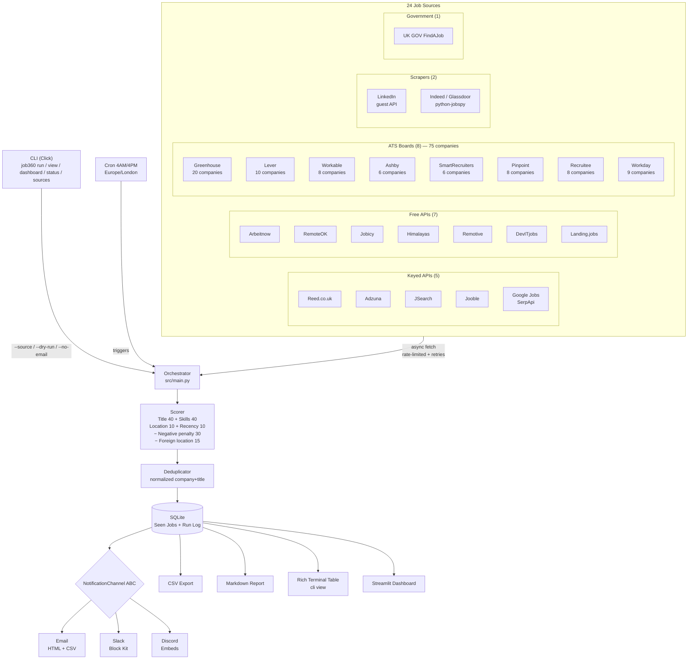

# Job360

Automated UK AI/ML job search system. Aggregates jobs from 24 sources, scores them 0-100 against your CV profile, deduplicates across sources, and delivers results via CLI, email, Slack, Discord, CSV, Rich terminal table, and a Streamlit dashboard.

## Architecture



## Features

### Job Sources (24)
- **5 keyed APIs**: Reed, Adzuna, JSearch, Jooble, Google Jobs (SerpApi) — skip gracefully if no API key set
- **7 free APIs**: Arbeitnow, RemoteOK, Jobicy, Himalayas, Remotive, DevITjobs, Landing.jobs — work without any configuration
- **8 ATS boards**: Greenhouse (20 companies), Lever (10), Workable (8), Ashby (6), SmartRecruiters (6), Pinpoint (8), Recruitee (8), Workday (9) — 75 companies total
- **2 scrapers**: LinkedIn (guest API), Indeed/Glassdoor (via python-jobspy)
- **1 government feed**: UK GOV FindAJob RSS

### Scoring (0-100)
- **Title match** (0-40 pts) — exact match = 40, partial = 20, keyword overlap = 5 each
- **Skill match** (0-40 pts) — primary skills 3pts, secondary 2pts, tertiary 1pt (capped at 40)
- **Location** (0-10 pts) — target UK location = 10, remote = 8
- **Recency** (0-10 pts) — 0-1 days = 10, 1-3 days = 8, 3-5 days = 6, 5-7 days = 4, 7+ days = 0
- **Negative keyword penalty** (-30 pts) — titles matching irrelevant roles (sales, nursing, etc.) are penalised
- **Foreign location penalty** (-15 pts) — jobs with non-UK locations (US states, EU countries, etc.) are penalised
- **Experience level detection** — parses Senior, Lead, Junior, Principal, etc. from title

### Data Quality
- **HTML entity decoding** — cleans `&amp;`, `&lt;`, etc. from job descriptions
- **Company name cleaning** — strips suffixes like "Ltd", "Inc", "Limited" for consistent dedup
- **Salary outlier filtering** — ignores unrealistic salary values

### Notifications (extensible)
- **Email** — HTML digest with top jobs, scores, apply links, and CSV attachment via Gmail SMTP
- **Slack** — rich Block Kit message with top 10 jobs via webhook
- **Discord** — embed message with top 10 jobs via webhook
- **NotificationChannel ABC** — add a new channel (e.g. Telegram) by implementing one class

### CLI (Click)
- `run` — full pipeline with `--source`, `--dry-run`, `--log-level`, `--db-path`, `--no-email`, `--dashboard` options
- `view` — Rich terminal table with `--hours`, `--min-score`, `--source`, `--visa-only`, `--db-path` filters
- `dashboard` — launch Streamlit web UI
- `status` — show last run stats from database
- `sources` — list all 24 available sources

### Dashboard (Streamlit)
- Sidebar filters: text search, score range, source, location, visa sponsorship
- KPI row: total jobs, avg score, top score, visa sponsors, sources count
- Score distribution histogram + jobs by source pie chart
- Sortable job listings table with clickable apply links
- CSV export button
- Run history with timeline chart
- Previous exports file browser
- Trigger new search from UI

### Infrastructure
- **Deduplication** — same job from different sources merged by normalised company+title
- **Persistent tracking** — SQLite database prevents duplicate notifications across runs
- **Visa flagging** — automatically flags jobs mentioning visa/sponsorship keywords
- **Async rate limiting** — per-source concurrency + delay (configurable in settings.py)
- **Retry logic** — 3 attempts with exponential backoff (1s, 2s, 4s) + 30s timeout
- **Cron scheduling** — `cron_setup.sh` sets up 4AM/4PM UK time (Europe/London)
- **Logging** — rotating file handler (5MB max, 3 backups) + console output
- **Dry-run mode** — fetch and score without writing to DB or sending notifications
- **Split requirements** — prod deps in `requirements.txt`, dev/test in `requirements-dev.txt`
- **Hardened setup** — Python 3.9+ version check, idempotent installs, .env validation

### Testing (212 tests)

| Test file | Count | What it covers |
|-----------|-------|----------------|
| `test_scorer.py` | 53 | Scoring algorithm, penalties, recency tiers, edge cases |
| `test_time_buckets.py` | 33 | Time bucket grouping logic |
| `test_sources.py` | 28 | All 24 sources with mocked HTTP |
| `test_models.py` | 17 | Job dataclass, normalisation, company cleaning |
| `test_notifications.py` | 13 | Email, Slack, Discord sending |
| `test_deduplicator.py` | 12 | Cross-source dedup logic |
| `test_main.py` | 9 | Orchestrator integration |
| `test_cli.py` | 8 | CLI commands + options |
| `test_notification_base.py` | 7 | ABC, format_salary, channel discovery |
| `test_database.py` | 6 | SQLite operations |
| `test_reports.py` | 6 | Markdown + HTML report generation |
| `test_setup.py` | 6 | setup.sh validation |
| `test_cli_view.py` | 5 | Rich terminal table viewer |
| `test_cron.py` | 5 | cron_setup.sh validation |
| `test_csv_export.py` | 4 | CSV export format |

## Quick Start

```bash
# 1. Clone and setup
git clone https://github.com/Ranjith36963/job360.git
cd job360
bash setup.sh

# 2. Configure API keys
nano .env

# 3. Run job search
source venv/bin/activate
python -m src.cli run

# 4. Single source / dry run
python -m src.cli run --source arbeitnow
python -m src.cli run --dry-run --log-level DEBUG

# 5. View results in terminal
python -m src.cli view --hours 24 --min-score 50

# 6. Launch dashboard
python -m src.cli dashboard

# 7. Schedule (optional)
bash cron_setup.sh
```

## CLI Usage

```bash
# Full pipeline — fetch from all sources, score, deduplicate, notify
python -m src.cli run

# Single source only
python -m src.cli run --source arbeitnow
python -m src.cli run --source reed

# Dry run — fetch and score, skip DB writes and notifications
python -m src.cli run --dry-run

# Skip email notifications
python -m src.cli run --no-email

# Launch dashboard after pipeline completes
python -m src.cli run --dashboard

# Debug logging
python -m src.cli run --log-level DEBUG

# Custom database path
python -m src.cli run --db-path /tmp/test.db

# Combine options
python -m src.cli run --source greenhouse --dry-run --log-level DEBUG

# View jobs in Rich terminal table
python -m src.cli view
python -m src.cli view --hours 24 --min-score 50
python -m src.cli view --source reed --visa-only
python -m src.cli view --db-path /tmp/test.db

# Launch Streamlit dashboard
python -m src.cli dashboard

# Show last run stats
python -m src.cli status

# List all available sources
python -m src.cli sources
```

## API Key Setup

| Source | Signup | ENV Variable |
|--------|--------|-------------|
| Reed.co.uk | [reed.co.uk/developers](https://www.reed.co.uk/developers/jobseeker) | `REED_API_KEY` |
| Adzuna | [developer.adzuna.com](https://developer.adzuna.com/) | `ADZUNA_APP_ID`, `ADZUNA_APP_KEY` |
| JSearch | [rapidapi.com/jsearch](https://rapidapi.com/letscrape-6bRBa3QguO5/api/jsearch) | `JSEARCH_API_KEY` |
| Jooble | [jooble.org/api](https://jooble.org/api/about) | `JOOBLE_API_KEY` |
| Google Jobs | [serpapi.com](https://serpapi.com/) | `SERPAPI_KEY` |
| Gmail | [Google App Passwords](https://myaccount.google.com/apppasswords) | `SMTP_EMAIL`, `SMTP_PASSWORD`, `NOTIFY_EMAIL` |
| Slack | [Slack Webhooks](https://api.slack.com/messaging/webhooks) | `SLACK_WEBHOOK_URL` |
| Discord | [Discord Webhooks](https://discord.com/developers/docs/resources/webhook) | `DISCORD_WEBHOOK_URL` |

**Free sources (no key needed)**: Arbeitnow, RemoteOK, Jobicy, Himalayas, Remotive, DevITjobs, Landing.jobs, LinkedIn, Greenhouse, Lever, Workable, Ashby, SmartRecruiters, Pinpoint, Recruitee, Workday, Indeed/Glassdoor, FindAJob — the system works without any API keys, skipping keyed sources gracefully.

## Scoring Algorithm

| Component | Points | How it works |
|-----------|--------|-------------|
| **Title match** | 0-40 | Exact match to target titles (AI Engineer, ML Engineer, etc.) = 40pts. Partial match = 20pts. Keyword overlap = 5pts each |
| **Skill match** | 0-40 | Primary skills (Python, PyTorch, LangChain, etc.) = 3pts each. Secondary (Docker, AWS, SageMaker) = 2pts each. Tertiary (CI/CD, Git, MLflow) = 1pt each. Capped at 40 |
| **Location** | 0-10 | Target UK location (London, Manchester, etc.) = 10pts. Remote = 8pts |
| **Recency** | 0-10 | Posted 0-1 days ago = 10pts, 1-3 days = 8pts, 3-5 days = 6pts, 5-7 days = 4pts, 7+ days = 0pts |
| **Negative keyword** | -30 | Titles matching irrelevant roles (sales engineer, recruiter, nurse, etc.) get a 30-point penalty |
| **Foreign location** | -15 | Non-UK locations (US states, EU countries, etc.) get a 15-point penalty |

**Total: 0-100** — minimum score threshold is 30 (configurable in `settings.py`)

## Notification Channels

The notification system uses an abstract base class (`NotificationChannel` in `src/notifications/base.py`) with auto-discovery:

```
NotificationChannel (ABC)
├── EmailChannel      — configured if SMTP_EMAIL + SMTP_PASSWORD + NOTIFY_EMAIL set
├── SlackChannel      — configured if SLACK_WEBHOOK_URL set
└── DiscordChannel    — configured if DISCORD_WEBHOOK_URL set
```

`get_configured_channels()` returns only channels whose env vars are set. The orchestrator loops over them:

```python
for channel in get_configured_channels():
    await channel.send(new_jobs, stats)
```

**Adding a new channel** (e.g. Telegram): create `src/notifications/telegram_notify.py`, implement `NotificationChannel`, and register it in `get_all_channels()`.

## Configuration

### Keywords (`src/config/keywords.py`)
- **25 job titles**: AI Engineer, ML Engineer, Machine Learning Engineer, GenAI Engineer, Generative AI Engineer, LLM Engineer, NLP Engineer, Data Scientist, MLOps Engineer, AI/ML Engineer, Deep Learning Engineer, Computer Vision Engineer, RAG Engineer, AI Solutions Engineer, AI Research Engineer, Applied ML Engineer, Python AI Developer, AI Researcher, ML Scientist, Machine Learning Scientist, AI Platform Engineer, AI Infrastructure Engineer, Conversational AI Engineer, Applied Scientist, Research Scientist
- **15 primary skills** (3pts each): Python, PyTorch, TensorFlow, LangChain, RAG, LLM, Generative AI, Hugging Face, Transformers, OpenAI, NLP, Deep Learning, Neural Networks, Computer Vision, Prompt Engineering
- **17 secondary skills** (2pts each): Scikit-learn, Keras, AWS, SageMaker, Bedrock, Docker, Kubernetes, FastAPI, ChromaDB, FAISS, OpenSearch, Redis, pgvector, Gemini, Agentic AI, LLM fine-tuning, Fine-tuning
- **11 tertiary skills** (1pt each): CI/CD, MLflow, Git, Linux, n8n, Data Pipelines, ETL, Feature Engineering, S3, CloudWatch, Machine Learning
- **24 UK locations** + Remote/Hybrid
- **~60 negative title keywords** across 12 categories (sales, IT ops, healthcare, legal, finance, etc.)

### Companies (`src/config/companies.py`)
- **Greenhouse** (20): DeepMind, Monzo, Deliveroo, Darktrace, Stability AI, Anthropic, Graphcore, Wayve, PolyAI, Synthesia, Wise, Snyk, Stripe, Cloudflare, Databricks, Dataiku, Ocado Technology, Tractable, Paddle, Harness
- **Lever** (10): Mistral, Healx, Palantir, Spotify, ZOE, Tractable, Helsing, SecondMind, MosaicML, Faculty
- **Workable** (8): BenevolentAI, Exscientia, Oxa, Cervest, Hugging Face, Labelbox, Runway, Adept
- **Ashby** (6): Anthropic, Cohere, OpenAI, Improbable, Synthesia, Multiverse
- **SmartRecruiters** (6): Wise, Revolut, Checkout.com, AstraZeneca, Samsung R&D UK, Booking
- **Pinpoint** (8): MoneySuperMarket, Bulb, Starling Bank, Octopus Energy, Faculty, Arm, Sky, Tesco Technology
- **Recruitee** (8): Peak AI, Satalia, Speech Graphics, Signal AI, Eigen Technologies, Causaly, Kheiron Medical, PolyAI
- **Workday** (9): AstraZeneca, NVIDIA, Shell, Roche, Novartis, Cisco, Dell, Intel, Unilever

## Project Structure

```
job360/
├── src/
│   ├── main.py                  # Central orchestrator (run_search, SOURCE_REGISTRY)
│   ├── cli.py                   # Click CLI (run, view, dashboard, status, sources)
│   ├── cli_view.py              # Rich terminal table viewer (time-bucketed)
│   ├── models.py                # Job dataclass with company normalisation
│   ├── dashboard.py             # Streamlit web dashboard (filters, charts, KPIs)
│   ├── config/
│   │   ├── settings.py          # Env vars, rate limits, timeouts, thresholds
│   │   ├── keywords.py          # 25 job titles, skills (3 tiers), 24 locations, ~60 negative keywords
│   │   └── companies.py         # ATS company slugs (75 companies across 8 platforms)
│   ├── sources/
│   │   ├── base.py              # Abstract base with retry logic + rate limiting
│   │   ├── reed.py              # Reed.co.uk API (keyed)
│   │   ├── adzuna.py            # Adzuna API (keyed)
│   │   ├── jsearch.py           # JSearch/RapidAPI (keyed)
│   │   ├── jooble.py            # Jooble API (keyed)
│   │   ├── google_jobs.py       # Google Jobs via SerpApi (keyed)
│   │   ├── arbeitnow.py         # Arbeitnow (free)
│   │   ├── remoteok.py          # RemoteOK (free)
│   │   ├── jobicy.py            # Jobicy (free)
│   │   ├── himalayas.py         # Himalayas (free)
│   │   ├── remotive.py          # Remotive (free)
│   │   ├── devitjobs.py         # DevITjobs (free)
│   │   ├── landingjobs.py       # Landing.jobs (free)
│   │   ├── greenhouse.py        # Greenhouse ATS (20 companies)
│   │   ├── lever.py             # Lever ATS (10 companies)
│   │   ├── workable.py          # Workable ATS (8 companies)
│   │   ├── ashby.py             # Ashby ATS (6 companies)
│   │   ├── smartrecruiters.py   # SmartRecruiters ATS (6 companies)
│   │   ├── pinpoint.py          # Pinpoint ATS (8 companies)
│   │   ├── recruitee.py         # Recruitee ATS (8 companies)
│   │   ├── workday.py           # Workday ATS (9 companies)
│   │   ├── linkedin.py          # LinkedIn (guest API scraper)
│   │   ├── indeed.py            # Indeed (via python-jobspy)
│   │   └── findajob.py          # UK GOV FindAJob RSS
│   ├── filters/
│   │   ├── skill_matcher.py     # Scoring engine (0-100, 4 components + 2 penalties)
│   │   └── deduplicator.py      # Cross-source dedup by normalised key
│   ├── notifications/
│   │   ├── base.py              # NotificationChannel ABC + auto-discovery
│   │   ├── email_notify.py      # Gmail SMTP (HTML + CSV attachment)
│   │   ├── slack_notify.py      # Slack Block Kit via webhook
│   │   ├── discord_notify.py    # Discord embeds via webhook
│   │   └── report_generator.py  # Markdown + HTML report generation
│   ├── storage/
│   │   ├── database.py          # Async SQLite (jobs + run_log tables)
│   │   └── csv_export.py        # CSV export per run
│   └── utils/
│       ├── logger.py            # Rotating file + console logging
│       ├── rate_limiter.py      # Async semaphore + delay rate limiter
│       └── time_buckets.py      # Time bucket grouping for CLI view
├── tests/                       # 212 tests across 15 files
│   ├── conftest.py              # Shared fixtures (sample jobs)
│   ├── test_scorer.py           # 53 tests — scoring, penalties, edge cases
│   ├── test_time_buckets.py     # 33 tests — time bucket grouping
│   ├── test_sources.py          # 28 tests — all 24 sources (mocked HTTP)
│   ├── test_models.py           # 17 tests — Job dataclass, normalisation
│   ├── test_notifications.py    # 13 tests — email, slack, discord
│   ├── test_deduplicator.py     # 12 tests — cross-source dedup
│   ├── test_main.py             # 9 tests — orchestrator integration
│   ├── test_cli.py              # 8 tests — CLI commands + options
│   ├── test_notification_base.py # 7 tests — ABC, discovery, format_salary
│   ├── test_database.py         # 6 tests — SQLite operations
│   ├── test_reports.py          # 6 tests — markdown + HTML reports
│   ├── test_setup.py            # 6 tests — setup.sh validation
│   ├── test_cli_view.py         # 5 tests — Rich terminal table viewer
│   ├── test_cron.py             # 5 tests — cron_setup.sh validation
│   └── test_csv_export.py       # 4 tests — CSV export
├── data/                        # Exports, reports, logs (gitignored)
├── requirements.txt             # Production dependencies
├── requirements-dev.txt         # Dev/test dependencies (pytest, aioresponses)
├── .env.example                 # Template for API keys and webhooks
├── setup.sh                     # Setup script (Python 3.9+ check, venv, deps)
└── cron_setup.sh                # Cron scheduling (4AM/4PM Europe/London)
```

## Testing

```bash
# Run all 212 tests
python -m pytest tests/ -v

# Run specific test file
python -m pytest tests/test_scorer.py -v

# Run with output
python -m pytest tests/ -v -s
```

All 212 tests pass. Every source is tested with mocked HTTP responses (aioresponses). No network access required.

## Output

Each run produces:

| Output | Location | Description |
|--------|----------|-------------|
| CSV | `data/exports/jobs_YYYYMMDD_HHMMSS.csv` | Full job data with scores |
| Markdown | `data/reports/report_YYYYMMDD_HHMMSS.md` | Ranked job tables |
| Rich table | Terminal (`python -m src.cli view`) | Time-bucketed terminal table with filters |
| Email | Inbox | HTML digest with top jobs + CSV attachment |
| Slack | Channel | Block Kit message with top 10 jobs |
| Discord | Channel | Embed message with top 10 jobs |
| Dashboard | `http://localhost:8501` | Interactive Streamlit UI |
| Console | Terminal | Summary of new jobs found |
| Logs | `data/logs/job360.log` | Rotating log file (5MB, 3 backups) |
