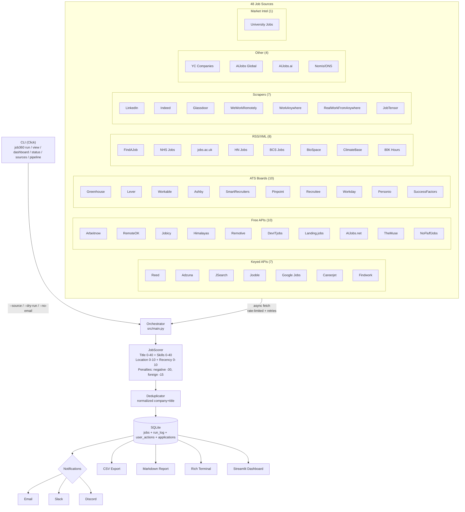

# Job360

Automated UK job search system supporting **any professional domain**. Aggregates jobs from 48 sources, scores them 0-100 against your CV profile, deduplicates across sources, and delivers results via CLI, email, Slack, Discord, CSV, Rich terminal table, and a Streamlit dashboard. A user profile with CV is **mandatory** — no CV = no search.

## Architecture


```mermaid
flowchart TD
    CLI["CLI (Click)\njob360 run / view / dashboard / status / sources / pipeline"]

    subgraph Sources["48 Job Sources"]
        direction LR
        subgraph Keyed["Keyed APIs (7)"]
            A1[Reed] & A2[Adzuna] & A3[JSearch] & A4[Jooble]
            A5[Google Jobs] & A6[Careerjet] & A7[Findwork]
        end
        subgraph Free["Free APIs (10)"]
            B1[Arbeitnow] & B2[RemoteOK] & B3[Jobicy] & B4[Himalayas]
            B5[Remotive] & B6[DevITjobs] & B7[Landing.jobs]
            B8[AIJobs.net] & B9[TheMuse] & B10[NoFluffJobs]
        end
        subgraph ATS["ATS Boards (10)"]
            C1[Greenhouse] & C2[Lever] & C3[Workable] & C4[Ashby]
            C5[SmartRecruiters] & C6[Pinpoint] & C7[Recruitee]
            C8[Workday] & C9[Personio] & C10[SuccessFactors]
        end
        subgraph RSS["RSS/XML (8)"]
            D1[FindAJob] & D2[NHS Jobs] & D3[jobs.ac.uk]
            D4[HN Jobs] & D5[BCS Jobs] & D6[BioSpace]
            D7[ClimateBase] & D8[80K Hours]
        end
        subgraph Scraper["Scrapers (7)"]
            E1[LinkedIn] & E2[Indeed] & E3[Glassdoor]
            E4[WeWorkRemotely] & E5[WorkAnywhere]
            E6[RealWorkFromAnywhere] & E7[JobTensor]
        end
        subgraph Other["Other (4)"]
            F1[YC Companies] & F2[AIJobs Global]
            F3[AIJobs.ai] & F4[Nomis/ONS]
        end
        subgraph Intel["Market Intel (1)"]
            G1[University Jobs]
        end
    end

    CLI -->|"--source / --dry-run / --no-email"| Orchestrator["Orchestrator\nsrc/main.py"]
    Sources -->|async fetch\nrate-limited + retries| Orchestrator
    Orchestrator --> Scorer["JobScorer\nTitle 0-40 + Skills 0-40\nLocation 0-10 + Recency 0-10\nPenalties: negative -30, foreign -15"]
    Scorer --> Dedup["Deduplicator\nnormalized company+title"]
    Dedup --> DB[(SQLite\njobs + run_log + user_actions + applications)]

    DB --> Channels{Notifications}
    Channels --> Email[Email] & Slack[Slack] & Discord[Discord]
    DB --> CSV[CSV Export] & Report[Markdown Report]
    DB --> RichTable[Rich Terminal] & Dashboard[Streamlit Dashboard]
```

## Features

### Phase 1 — Core Pipeline
- 48 job sources (7 keyed, 10 free, 10 ATS, 8 RSS, 7 scrapers, 4 other, 1 intel)
- Scoring 0-100: Title (40) + Skills (40) + Location (10) + Recency (10) − Penalties
- CV-mandatory profile system — parses PDF/DOCX CVs
- Deduplication by normalized company+title
- Notifications: Email (HTML+CSV), Slack (Block Kit), Discord (Embeds)
- CLI: run, view, dashboard, status, sources, pipeline, setup-profile
- Streamlit dashboard with filters, charts, KPIs, CSV export

### Phase 2 — Profile Enrichment
- LinkedIn ZIP export parsing (skills, positions, education)
- GitHub API integration (public repos → inferred skills)
- Interactive profile setup with merged CV + preferences

### Phase 3 — Intelligence Layer
- Controlled skill inference (`skill_graph.py`, ~100 relationships, threshold ≥ 0.7)
- AI-powered CV summarization (optional Anthropic/OpenAI LLM)
- Skill-to-description matching with ~65 synonym groups
- Job recommendation engine (Like/Apply/Not Interested per job)
- Interview tracking pipeline with stages and 7-day reminders

### Infrastructure
- Async rate limiting per source (configurable concurrency + delay)
- Retry logic: 3 attempts, exponential backoff (1s, 2s, 4s), 30s timeout
- Circuit breaker: skip source after 3 consecutive failures
- SQLite with WAL mode, schema versioning, 4 tables
- Rotating log files (5MB, 3 backups)
- Dry-run mode, cron scheduling, split requirements

## Quick Start

```bash
# 1. Clone and setup
git clone https://github.com/Ranjith36963/job360.git
cd job360
python -m venv .venv && source .venv/bin/activate  # or .venv\Scripts\activate on Windows
pip install -r requirements.txt

# 2. Set up your profile (CV is mandatory)
python -m src.cli setup-profile --cv path/to/cv.pdf

# 3. Configure API keys (optional — free sources work without keys)
cp .env.example .env && nano .env

# 4. Run job search
python -m src.cli run

# 5. View results
python -m src.cli view --hours 24 --min-score 50
python -m src.cli dashboard
```

## CLI Usage

```bash
# Full pipeline
python -m src.cli run
python -m src.cli run --source arbeitnow          # Single source
python -m src.cli run --dry-run --log-level DEBUG  # Debug mode
python -m src.cli run --no-email                   # Skip notifications

# Profile setup
python -m src.cli setup-profile --cv cv.pdf
python -m src.cli setup-profile --cv cv.pdf --linkedin export.zip --github username

# View jobs
python -m src.cli view --hours 24 --min-score 50
python -m src.cli view --source reed --visa-only

# Application pipeline
python -m src.cli pipeline                         # All applications
python -m src.cli pipeline --stage interview       # Filter by stage
python -m src.cli pipeline --reminders             # Due reminders

# Other
python -m src.cli dashboard                        # Streamlit UI
python -m src.cli status                           # Last run stats
python -m src.cli sources                          # List all 48 sources
```

## Scoring Algorithm

| Component | Points | How it works |
|-----------|--------|-------------|
| **Title match** | 0-40 | Exact match to target titles = 40, partial = 20, keyword overlap = 5 each |
| **Skill match** | 0-40 | Primary skills 3pts, secondary 2pts, tertiary 1pt (capped at 40) |
| **Location** | 0-10 | Target UK location = 10, remote = 8 |
| **Recency** | 0-10 | 0-1 days = 10, 1-3d = 8, 3-5d = 6, 5-7d = 4, 7+ = 0 |
| **Negative keyword** | -30 | Irrelevant role titles penalised |
| **Foreign location** | -15 | Non-UK locations penalised |

**Total: 0-100** — minimum threshold: `MIN_MATCH_SCORE=30`

All keywords come from the user's CV and preferences — no hard-coded domain defaults.

## API Key Setup

| Source | Signup | ENV Variable |
|--------|--------|-------------|
| Reed.co.uk | [reed.co.uk/developers](https://www.reed.co.uk/developers/jobseeker) | `REED_API_KEY` |
| Adzuna | [developer.adzuna.com](https://developer.adzuna.com/) | `ADZUNA_APP_ID`, `ADZUNA_APP_KEY` |
| JSearch | [rapidapi.com/jsearch](https://rapidapi.com/letscrape-6bRBa3QguO5/api/jsearch) | `JSEARCH_API_KEY` |
| Jooble | [jooble.org/api](https://jooble.org/api/about) | `JOOBLE_API_KEY` |
| Google Jobs | [serpapi.com](https://serpapi.com/) | `SERPAPI_KEY` |
| Careerjet | [careerjet.com/partners](https://www.careerjet.com/partners/) | `CAREERJET_AFFID` |
| Findwork | [findwork.dev](https://findwork.dev/) | `FINDWORK_API_KEY` |
| Gmail | [Google App Passwords](https://myaccount.google.com/apppasswords) | `SMTP_EMAIL`, `SMTP_PASSWORD`, `NOTIFY_EMAIL` |
| Slack | [Slack Webhooks](https://api.slack.com/messaging/webhooks) | `SLACK_WEBHOOK_URL` |
| Discord | [Discord Webhooks](https://discord.com/developers/docs/resources/webhook) | `DISCORD_WEBHOOK_URL` |

Free sources (no key needed) work without any configuration.

## Testing

```bash
python -m pytest tests/ -v              # All 435+ tests
python -m pytest tests/test_scorer.py -v  # Single file
```

All tests pass. Every source is tested with mocked HTTP responses (aioresponses). No network access required.

## Configuration

See `.env.example` for all configurable parameters including API keys, notification webhooks, LLM settings, salary range, and search thresholds.

## License

MIT
