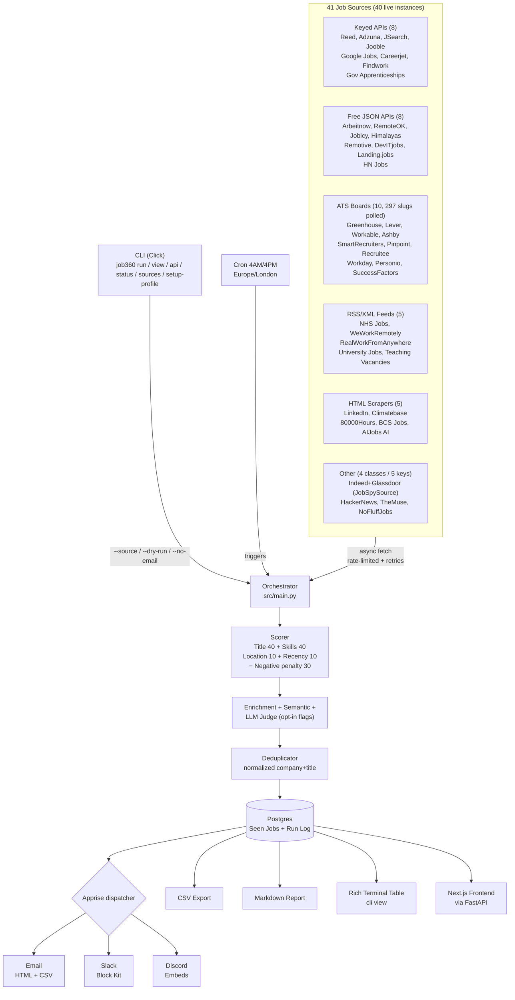

# Job360
<!-- doc: LIVING | last-verified: 2026-08-25 by the nightly doc-truth routine -->

Automated UK job search system supporting **any professional domain**. Aggregates jobs from **40 source instances** (41 keys in `SOURCE_REGISTRY`; `indeed`/`glassdoor` share `JobSpySource`), scores them 0–100 against your profile (CV, LinkedIn, GitHub, and manual preferences), deduplicates via a four-layer cascade, and delivers results via CLI, email/Slack/Discord/Telegram/webhook (per-user via Apprise), CSV, Rich terminal table, and a Next.js dashboard backed by FastAPI.

> **A profile is required.** Default keyword lists (`JOB_TITLES`, `PRIMARY_SKILLS`, …) were emptied on 2026-04-09 (commit `3ba1342`). Without a profile, the system has nothing to score against — `setup-profile` is now a mandatory first step, not optional.

> **For current architecture detail**: see [`docs/product/pillars/`](./docs/product/pillars/) — three code-verified pillar manuals (User, Search & Match Engine, Job Providers) plus a glossary and runbook. The sections below in this README cover quick-start and CLI; the pillar docs are authoritative for system internals.

### API docs (auto-generated)

Once the backend is running (`cd backend && python main.py`), interactive API docs are served at **http://localhost:8000/docs** (Swagger UI) and **http://localhost:8000/redoc** (ReDoc). Both are generated from the FastAPI route decorators + Pydantic models — no separate maintenance.

## Architecture


```mermaid
flowchart TD
    CLI["CLI (Click)\njob360 run / view / api / status / sources / setup-profile"]
    Cron["Cron 4AM/4PM\nEurope/London"]

    subgraph Sources["41 Job Sources (40 live instances)"]
        direction LR
        KeyedAPIs["Keyed APIs (8)\nReed, Adzuna, JSearch, Jooble\nGoogle Jobs, Careerjet, Findwork\nGov Apprenticeships"]
        FreeJSON["Free JSON APIs (8)\nArbeitnow, RemoteOK, Jobicy, Himalayas\nRemotive, DevITjobs, Landing.jobs\nHN Jobs"]
        ATSBoards["ATS Boards (10, 297 slugs polled)\nGreenhouse, Lever, Workable, Ashby\nSmartRecruiters, Pinpoint, Recruitee\nWorkday, Personio, SuccessFactors"]
        RSSFeeds["RSS/XML Feeds (5)\nNHS Jobs, WeWorkRemotely\nRealWorkFromAnywhere\nUniversity Jobs, Teaching Vacancies"]
        HTMLScrapers["HTML Scrapers (5)\nLinkedIn, Climatebase\n80000Hours, BCS Jobs, AIJobs AI"]
        OtherSources["Other (4 classes / 5 keys)\nIndeed+Glassdoor (JobSpySource)\nHackerNews, TheMuse, NoFluffJobs"]
    end

    CLI -->|"--source / --dry-run / --no-email"| Orchestrator["Orchestrator\nsrc/main.py"]
    Cron -->|triggers| Orchestrator
    Sources -->|async fetch\nrate-limited + retries| Orchestrator
    Orchestrator --> Scorer["Scorer\nTitle 40 + Skills 40\nLocation 10 + Recency 10\n− Negative penalty 30"]
    Scorer --> OptEngines["Enrichment + Semantic +\nLLM Judge (opt-in flags)"]
    OptEngines --> Dedup[Deduplicator\nnormalized company+title]
    Dedup --> DB[(Postgres\nSeen Jobs + Run Log)]

    DB --> Channels{Apprise dispatcher}
    Channels --> Email[Email\nHTML + CSV]
    Channels --> Slack[Slack\nBlock Kit]
    Channels --> Discord[Discord\nEmbeds]

    DB --> CSV[CSV Export]
    DB --> Report[Markdown Report]
    DB --> RichTable[Rich Terminal Table\ncli view]
    DB --> NextJS[Next.js Frontend\nvia FastAPI]
```

## Features

### Job Sources (40 classes / 41 registry keys / 40 instances)

> The reconciliation: 40 *class files* on disk → 41 *registry keys* (`indeed`+`glassdoor` both map to `JobSpySource`) → 40 *live instances* per run. Test assertions pin all three (`test_cli.py` requires `len(SOURCE_REGISTRY) == 41`).

- **8 keyed APIs**: Reed, Adzuna, JSearch, Jooble, Google Jobs (SerpApi), Careerjet, Findwork, Gov Apprenticeships (DfE) — skip gracefully if no API key set
- **8 free JSON APIs** (`category="free_json"`): Arbeitnow, RemoteOK, Jobicy, Himalayas, Remotive, DevITjobs, Landing.jobs, HN Jobs — no auth required; Teaching Vacancies *(Batch 3)* is a 9th file in `apis_free/` but runs on the 15-min RSS scheduler tier (`category="rss"`) not the free_json tier, so it is counted under RSS/XML below
- **10 ATS boards** polling 297 company slugs: Greenhouse, Lever, Workable, Ashby, SmartRecruiters, Pinpoint, Recruitee, Workday, Personio, SuccessFactors — see `backend/src/core/companies.py`, which holds **302** slugs across 11 platform lists; `RIPPLING_COMPANIES` (5) has had no source class since the 2026-08-10 rotation, so 10 boards poll the other 297
- **5 RSS/XML feeds** (`category="rss"`): NHS Jobs (keyword search), WeWorkRemotely, RealWorkFromAnywhere, University Jobs, plus Teaching Vacancies *(lives in `apis_free/` but runs on the 15-min RSS tier)*
- **5 HTML scrapers**: LinkedIn (guest API), Climatebase, 80000Hours, BCS Jobs, AIJobs AI
- **4 other**: Indeed/Glassdoor (via optional `python-jobspy`), HackerNews (Algolia), TheMuse, NoFluffJobs

**Dropped in Batch 3**: `yc_companies` (covered by HN Jobs + Ashby), `findajob` (duplicate of Adzuna), `nomis` (UK ONS *statistics*, not vacancy listings). **Dropped in M6 rotation (2026-06)**: `jobtensor` (pivoted to JS-only German app), `comeet` (token-gated API), `aijobs_global` (board abandoned Oct 2023). `gov_apprenticeships` was briefly dropped but **restored 2026-06-16** on the DfE Display Advert API v2 (`DFE_APPRENTICESHIPS_API_KEY`; `category="keyed_api"`).

**Domain routing**: each source has a `.DOMAINS` set (`tech`, `healthcare`, `academia`, `education`, `climate`, or `general`). `classify_user_domain(profile)` filters sources to the user's domain set so a teacher doesn't get healthcare jobs and vice versa. See `docs/product/pillars/03-job-providers.md` §4.7.

### Profile System (any domain)
- **CV parsing**: Upload PDF or DOCX, extracts skills, job titles, education, certifications
- **LinkedIn enrichment**: Import a LinkedIn profile PDF (profile → More → Save to PDF) — positions, skills, education
- **GitHub enrichment**: Fetch public repos, infer skills from languages and topics
- **Interactive preferences**: Target titles, skills, locations, salary range, work arrangement
- **Dynamic keywords**: Profile generates personalised search queries, relevance keywords, and scoring criteria
- **Profile required**: As of 2026-04-09 the keyword fallback lists are empty — `setup-profile` must run before the engine can produce meaningful scores

### Scoring (0-100)
- **Title match** (0-40 pts) — exact match = 40, partial = 20, keyword overlap = 5 each
- **Skill match** (0-40 pts) — primary skills 3pts, secondary 2pts, tertiary 1pt (capped at 40)
- **Location** (0-10 pts) — target UK location = 10, remote = 8
- **Recency** (0-10 pts) — 0-1 days = 10, 1-3 days = 8, 3-5 days = 6, 5-7 days = 4, 7+ days = 0
- **Negative keyword penalty** (-30 pts) — titles matching irrelevant roles (sales, nursing, etc.) are penalised
- **No foreign-location penalty** — deleted 2026-08-12 (rule #30): a non-UK job is refused at the door (`services/uk_gate.check_uk`), never docked points
- **Experience level detection** — parses Senior, Lead, Junior, Principal, etc. from title

### Data Quality
- **HTML entity decoding** — cleans `&amp;`, `&lt;`, etc. from job descriptions
- **Company name cleaning** — strips suffixes like "Ltd", "Inc", "Limited", and region tags like "UK", "EMEA" for consistent dedup
- **Salary outlier filtering** — ignores unrealistic salary values (<10k or >500k)

### Notifications (extensible)
- **Email** — HTML digest with top jobs, scores, apply links, and CSV attachment via Gmail SMTP
- **Slack** — rich Block Kit message with top 10 jobs via webhook
- **Discord** — embed message with top 10 jobs via webhook
- **Apprise dispatcher** — per-user channels stored in the DB; add one as an Apprise URL, not a Python class

### CLI (Click)
- `run` — full pipeline with `--source`, `--dry-run`, `--log-level`, `--no-email` options
- `view` — Rich terminal table with `--hours`, `--min-score`, `--source`, `--visa-only` filters
- `setup-profile` — interactive profile wizard with `--cv`, `--linkedin`, `--github` options
- `api` — start the FastAPI backend server (consumed by the Next.js frontend)
- `status` — show last run stats from database
- `sources` — list all 41 registry sources (40 live instances)
- `rescore-backfill` — enqueue the resumable re-score drainer for stale `user_feed` rows, with `--batch-size`, `--max-users`, `--throttle`

### Frontend (Next.js + FastAPI)
- Next.js 16 + React 19 + Tailwind 4 + shadcn at `frontend/`
- Talks to FastAPI (`backend/src/api/`) over HTTP — 13 route modules, 72 endpoints (health, jobs, actions, profile, search, pipeline, tailor, channels, notifications, runs)
- Job list with filters, score radar, time buckets
- Profile setup: CV upload, LinkedIn profile PDF import, GitHub username, preferences form
- Application pipeline Kanban board

### Infrastructure
- **Deduplication** — same job from different sources merged by normalised company+title
- **Persistent tracking** — Postgres database prevents duplicate notifications across runs
- **Visa flagging** — automatically flags jobs mentioning visa/sponsorship keywords
- **Async rate limiting** — per-source concurrency + delay (configurable in settings.py)
- **Retry logic** — 3 attempts with exponential backoff (1s, 2s, 4s) + 30s timeout per request; per-source fetch ceiling 240s (ATS) / 60s (others) via `TieredScheduler.resolve_fetch_timeout()`
- **Cron scheduling** — `cron_setup.sh` sets up 4AM/4PM UK time (Europe/London)
- **Logging** — rotating file handler (5MB max, 3 backups) + console output
- **Dry-run mode** — fetch and score without writing to DB or sending notifications
- **Auto-purge** — jobs older than 30 days are automatically deleted on each run
- **Split requirements** — prod deps in `backend/pyproject.toml` `[project.dependencies]`, dev/test in the same file's `[project.optional-dependencies] dev` extra (`pip install -e ".[dev]"`). There is no `requirements*.txt` in the repo
- **Hardened setup** — Python 3.9+ version check, idempotent installs, .env validation

### Testing (218 `test_*.py` files; 2 `live` tests deselected offline)

> **The collected-test count is not written down anywhere on purpose.** Measure it:
> `cd backend && python -m pytest --collect-only -q -p no:randomly | tail -1`.
> `scripts/doc_sync_check.py` deliberately does not guard it (it needs Postgres, and
> parametrization makes any cheap check flaky), so any total committed to a doc is
> unguarded and silently rots — this table has carried a wrong one before.
>
> Per-file counts below are a **snapshot taken 2026-08-24**, not a live invariant; re-measure
> with `python -m pytest tests/<file>.py --collect-only -q -p no:randomly | tail -1`.
> `test_main.py` **is** in the canonical run — do not add `--ignore=tests/test_main.py`
> (root CLAUDE.md rule).

| Test file | Collected count | What it covers |
|-----------|-------|----------------|
| `test_profile.py` | 112 | CV parser, preferences, keyword generator, JobScorer |
| `test_sources.py` | 110 | All 41 sources with mocked HTTP |
| `test_scorer.py` | 92 | Scoring algorithm, penalties, recency tiers, edge cases |
| `test_linkedin_github.py` | 64 | LinkedIn PDF parsing (section-split + LLM), GitHub API enrichment |
| `test_deduplicator.py` | 35 | Cross-source dedup (incl. marketing-suffix B-4 tests) |
| `test_time_buckets.py` | 33 | Time bucket grouping logic |
| `test_api.py` | 27 | FastAPI endpoints (health, jobs, actions, profile, search, pipeline) |
| `test_models.py` | 25 | Job dataclass, normalisation, company cleaning |
| `test_main.py` | 18 | Orchestrator (IS in the canonical run — carries no `live` marker) |
| `test_llm_provider.py` | 18 | Multi-provider LLM client for CV parsing |
| `test_database.py` | 16 | Postgres operations, migrations, source history |
| `test_channels_dispatcher.py` | 15 | Apprise dispatch, quiet hours, digest queueing |
| `test_cli.py` | 11 | CLI commands + SOURCE_REGISTRY assertions |
| `test_notification_rules.py` | 11 | One-rulebook-per-user rules + routes |
| `test_reports.py` | 6 | Markdown + HTML report generation |
| `test_cli_view.py` | 6 | Rich terminal table viewer |
| `test_rate_limiter.py` | 5 | Async rate limiter |
| `test_cron.py` | 5 | cron_setup.sh validation |
| `test_setup.py` | 4 | setup.sh validation |
| `test_csv_export.py` | 4 | CSV export format |
| (the other 198 `test_*.py` files) | measure it | auth, feed, prefilter, channels, scheduler, circuit_breaker, enrichment, embeddings, retrieval, IDOR, account-mgmt, application history, llm_matcher, uk_gate, visa_signal, shelf registry, harness guards |

## Quick Start

```bash
# 1. Clone and setup
git clone https://github.com/Ranjith36963/job360.git
cd job360
bash setup.sh

# 2. Configure API keys (optional — free sources work without any keys)
nano .env

# 3. Run job search
source venv/bin/activate
python -m src.cli run

# 4. Single source / dry run
python -m src.cli run --source arbeitnow
python -m src.cli run --dry-run --log-level DEBUG

# 5. Set up a personalised profile
python -m src.cli setup-profile --cv path/to/cv.pdf
python -m src.cli setup-profile --cv cv.pdf --linkedin linkedin-profile.pdf --github yourusername

# 6. View results in terminal
python -m src.cli view --hours 24 --min-score 50

# 7. Start the API + frontend
python -m src.cli api            # FastAPI on :8000
# (in another terminal) cd frontend && npm run dev   # Next.js on :3000

# 8. Schedule (optional)
bash cron_setup.sh
```

## CLI Usage

```bash
# Full pipeline — fetch from all 41 sources (40 live instances), score, deduplicate, notify
python -m src.cli run

# Single source only
python -m src.cli run --source arbeitnow
python -m src.cli run --source reed

# Dry run — fetch and score, skip DB writes and notifications
python -m src.cli run --dry-run

# Skip email notifications
python -m src.cli run --no-email

# Debug logging
python -m src.cli run --log-level DEBUG

# Combine options
python -m src.cli run --source greenhouse --dry-run --log-level DEBUG

# Set up user profile (personalise for any domain)
python -m src.cli setup-profile --cv path/to/cv.pdf
python -m src.cli setup-profile --cv cv.pdf --linkedin linkedin-profile.pdf
python -m src.cli setup-profile --cv cv.pdf --github yourusername
python -m src.cli setup-profile --linkedin linkedin-profile.pdf --github user

# View jobs in Rich terminal table
python -m src.cli view
python -m src.cli view --hours 24 --min-score 50
python -m src.cli view --source reed --visa-only

# Start the FastAPI backend (consumed by the Next.js frontend)
python -m src.cli api

# Show last run stats
python -m src.cli status

# List all available sources
python -m src.cli sources
```

## API Key Setup

| Source | Signup | ENV Variable |
|--------|--------|-------------|
| Reed.co.uk | [reed.co.uk/developers](https://www.reed.co.uk/developers/jobseeker) | `REED_API_KEY` |
| Adzuna | [developer.adzuna.com](https://developer.adzuna.com/) | `ADZUNA_APP_ID`, `ADZUNA_APP_KEY` |
| JSearch | [rapidapi.com/jsearch](https://rapidapi.com/letscrape-6bRBa3QguO5/api/jsearch) | `JSEARCH_API_KEY` |
| Jooble | [jooble.org/api](https://jooble.org/api/about) | `JOOBLE_API_KEY` |
| Google Jobs | [serpapi.com](https://serpapi.com/) | `SERPAPI_KEY` |
| Careerjet | [careerjet.com/partners](https://www.careerjet.com/partners/) | `CAREERJET_AFFID` |
| Findwork | [findwork.dev](https://findwork.dev/) | `FINDWORK_API_KEY` |
| GitHub | [github.com/settings/tokens](https://github.com/settings/tokens) | `GITHUB_TOKEN` (optional, for profile enrichment) |
| Email delivery | [resend.com](https://resend.com/) | `RESEND_API_KEY` (+ `SMTP_FROM`). Powers magic-link email AND the per-user email alert channel. Falls back to `SMTP_EMAIL`/`SMTP_PASSWORD`/`SMTP_HOST`/`SMTP_PORT` over SMTP where the host allows it — Railway does not |

> **`NOTIFY_EMAIL`, `SLACK_WEBHOOK_URL` and `DISCORD_WEBHOOK_URL` no longer notify anyone.**
> They are still declared in `backend/src/core/settings.py:78,81,82` and read by
> nothing under `backend/src/`, `backend/tests/` or `scripts/`. They belonged to the
> pre-Batch-2 single-tenant notifier, which was deleted. Slack, Discord and Telegram
> are now per-user channels created through the Connect flow
> (`GET /api/settings/channels/connect/*`), not env vars.
>
> The names do appear elsewhere, and it is a different system: `cron_setup.sh:41-42`
> greps `.env` for them only to print a "configured" line, and CI sends its own
> build alerts through a `SLACK_WEBHOOK_URL` **repository secret**
> (`.github/workflows/post-merge-watch.yml:413-423`). Setting them in the app's
> environment still delivers nothing to a user.

**Free sources (no key needed)**: Arbeitnow, RemoteOK, Jobicy, Himalayas, Remotive, DevITjobs, Landing.jobs, HN Jobs, Teaching Vacancies, LinkedIn, Greenhouse, Lever, Workable, Ashby, SmartRecruiters, Pinpoint, Recruitee, Workday, Personio, SuccessFactors, NHS Jobs, WeWorkRemotely, RealWorkFromAnywhere, University Jobs, Climatebase, 80000Hours, BCS Jobs, AIJobs AI, Indeed/Glassdoor (if python-jobspy installed), HackerNews, TheMuse, NoFluffJobs, Gov Apprenticeships (DFE_APPRENTICESHIPS_API_KEY — key required) — **33 of 41 sources work without any API keys** (8 keyed). Dropped in Batch 3: yc_companies, findajob, nomis. Dropped in M6: jobtensor, comeet, aijobs_global. Dropped 2026-08-10 (dead upstreams): aijobs, rippling, biospace, jobs_ac_uk, workanywhere, nhs_jobs_xml.

## Scoring Algorithm

| Component | Points | How it works |
|-----------|--------|-------------|
| **Title match** | 0-40 | Exact match to target titles = 40pts. Partial match = 20pts. Keyword overlap = 5pts each |
| **Skill match** | 0-40 | Primary skills = 3pts each. Secondary = 2pts each. Tertiary = 1pt each. Capped at 40 |
| **Location** | 0-10 | Target UK location = 10pts. Remote = 8pts |
| **Recency** | 0-10 | Posted 0-1 days ago = 10pts, 1-3 days = 8pts, 3-5 days = 6pts, 5-7 days = 4pts, 7+ days = 0pts |
| **Negative keyword** | -30 | Titles matching irrelevant roles (sales engineer, recruiter, nurse, etc.) get a 30-point penalty |

There is **no foreign-location penalty**. It was deleted 2026-08-12 (rule #30): a non-UK job is refused at the door (`services/uk_gate.check_uk`), never docked points.

**Total: 0-100** — minimum score threshold is 30 (configurable in `settings.py`)

The scorer uses dynamic keywords from the user's profile (`SearchConfig`). Hard-coded default keyword lists in `core/keywords.py` are empty since 2026-04-09 — a profile is mandatory for the engine to produce meaningful scores. The 4-component formula above runs alongside the **Batch-2.9 multi-dimensional scoring** (seniority + salary + visa + workplace, each weighted via env vars `SENIORITY_WEIGHT`/`SALARY_WEIGHT`/`VISA_WEIGHT`/`WORKPLACE_WEIGHT`) whenever the user has filled in preferences — the dims are gated on `user_preferences` alone, and a job the enrichment pipeline has not reached yet scores each dim at its NEUTRAL half rather than zero (rule #20/#29). Final 9-field `ScoreBreakdown` documented in `docs/product/pillars/02-search-and-match-engine.md`.

## Matching engines (keyword → dimensions → hybrid → LLM judge)

Four engines, all opt-in except the keyword engine. **Engines 2–4 default OFF.**

**Engine 1 — Keyword** (always on): `services/skill_matcher.py` `JobScorer`. Title 40 / Skill 40 / Location 10 / Recency 10 formula (0–100), gates MIN_TITLE_GATE/MIN_SKILL_GATE (default 0.15), single −30 negative-title penalty.

**Engine 2 — Dimensions** (opt-in, `ENGINE2_ENABLED=true` / `ENRICHMENT_ENABLED=true`): `services/scoring_dimensions.py`, wired into `JobScorer` at `skill_matcher.py:582-617`. Adds four dimension scorers on top of the keyword score — Salary 10 / Seniority 8 / Visa 6 / Workplace 6 (raw max 130, clamped to [0, 100]). Its data is supplied by the **enrichment** step (`services/job_enrichment.py`): jobs scoring >= `ENRICHMENT_THRESHOLD` (default **10**, not 60 — `settings.py:152-155`) go to the OpenAI→Gemini→Groq→Cerebras LLM chain, stored in the shared `job_enrichment` table (16-field `JobEnrichment` schema, 7 enums, idempotent). Both halves are gated the same way — `ENGINE2_ENABLED or ENRICHMENT_ENABLED` (`main.py:853`, `main.py:1137`, `services/rescore.py:85`), so either name switches Engine 2 on (rule #18).

**Engine 3 — Hybrid retrieval** (opt-in, `SEMANTIC_ENABLED=true` / `ENGINE3_ENABLED=true`): `services/embeddings.py` encodes jobs via `all-MiniLM-L6-v2` (384-dim), stored in Postgres as `job_embeddings.embedding` (pgvector, migration `0027`) via `services/pg_vector_index.py`. The older ChromaDB wrapper `services/vector_index.py` still exists, but no production call site builds it — the on-disk store could not be shared between the backend and worker containers, so the scheduled run could never add an embedding and coverage froze at 284. Note the two flags are not interchangeable: `ENGINE3_ENABLED or SEMANTIC_ENABLED` opens the hybrid READ path (`api/routes/jobs.py:368-369`), but the embedding WRITES read `SEMANTIC_ENABLED` alone (`main.py:1292,1348`). Query path (`services/retrieval.py` `retrieve_for_user`, wired live via `_hybrid_reorder_rows` in `api/routes/jobs.py`) fuses three rankings via RRF (k=60) — keyword `match_score`, **BM25** (`bm25_rank`), and an **exact vector scan** (`ORDER BY cosine_distance(...) LIMIT k` — no ANN index exists yet, see migration `0027`) — then **cross-encoder reranks** the top survivors (`cross_encoder_rerank`, `ms-marco-MiniLM-L-6-v2`). Surfaced via `GET /api/jobs?mode=hybrid`. The BM25 leg is pure-Python, so it still applies even if the semantic leg or the reranker degrade.

**Engine 4 — LLM judge** (opt-in, `ENGINE4_ENABLED=true` / `MATCHER_ENABLED=true`, gate at `main.py:352`): `services/llm_matcher.py`. Per-user `MatchVerdict{fit_score 0-100, verdict, reason}` persisted onto `user_feed` (migration 0017). Runs after the per-user feed write (`_run_matcher_stage`). Feed reads rank by `COALESCE(llm_fit_score, score) DESC`. Dashboard shows AI-verdict badge. Measured: 18/18 jobs judged in 89.8 s (concurrency 3, Groq/Cerebras), judge spread 20–92 vs keyword 30–43, 10/10 fit accuracy on labeled sample.

## Notification Channels

Notification delivery goes through the **Apprise dispatcher** at
`backend/src/services/channels/dispatcher.py`. It handles multi-channel per-user delivery
(email/Slack/Discord/Telegram/webhook) and applies each user's rules: score threshold,
timezone-aware quiet hours, and digest mode.

> ⚠️ **The `NotificationChannel` ABC is GONE — do not write against it.** It used to live at
> `backend/src/services/notifications/base.py`. That file, the auto-discovery helpers
> (`get_all_channels()` / `get_configured_channels()`) and the per-channel classes were all
> REMOVED. What is left under `backend/src/services/notifications/` is `__init__.py`,
> `report_generator.py` and `defaults.py` (the signup rulebook seeder + the one source of
> truth for `NOTIFY_SCORE_THRESHOLD`) — no channel classes, no discovery.

Channels are **per-user rows in the database**, not env-var-configured classes. The
dispatcher's public surface:

```python
from src.services.channels import dispatcher

channels = await dispatcher.load_user_channels(db, user_id)  # the user's configured channels
await dispatcher.dispatch(...)                               # deliver, honouring the user's rules
await dispatcher.test_send(db, channel_id)                   # one-off "does this work?" send
```

**Adding a new channel** (e.g. Telegram): Apprise already speaks most services, so a channel is
normally a new Apprise URL stored against the user — not a new Python class. Recipe:
`.claude/skills/add-source/SKILL.md`.

## Adding a New Job Source

1. Create `backend/src/sources/yoursource.py`, extend `BaseJobSource`
2. Implement `async fetch_jobs() -> list[Job]`
3. Use `self.relevance_keywords` and `self.job_titles` for filtering (not direct imports)
4. If custom `__init__`, accept `search_config=None` and pass to `super().__init__(session, search_config=search_config)`
5. Register in `SOURCE_REGISTRY` dict in `backend/src/main.py`
6. Add to `_build_sources()` list in `backend/src/main.py` (passing `search_config=sc`)
7. Add rate limit entry in `RATE_LIMITS` dict in `backend/src/core/settings.py`
8. Add mocked tests in `backend/tests/test_sources.py`
9. Update the `len(SOURCE_REGISTRY) == N` assertion and expected source set in `backend/tests/test_cli.py` **and** the `== N` count checks in `backend/tests/test_api.py` (five surfaces total — see CLAUDE.md rule #8/#13)
10. If keyed: add env var to `backend/src/core/settings.py` and `.env.example`

## Configuration

### Default Keywords (`backend/src/core/keywords.py`)

**All AI/ML keyword lists were emptied on 2026-04-09 (commit `3ba1342`).** The following lists are now `[]`: `JOB_TITLES`, `PRIMARY_SKILLS`, `SECONDARY_SKILLS`, `TERTIARY_SKILLS`, `RELEVANCE_KEYWORDS`, `NEGATIVE_TITLE_KEYWORDS`. Without a user profile, sources iterate empty lists and return near-zero results — `setup-profile` is a mandatory first step.

What `keywords.py` still contains (domain-agnostic, applies to any profession):
- **24 UK place/country names** + `Remote` + `Hybrid` — 26 entries in the `LOCATIONS` list (`backend/src/core/keywords.py:28-55`). `_location_score` skips the two non-places, so only the 24 can score the full 10
- **8 visa/sponsorship keywords** (the `VISA_KEYWORDS` list: "visa sponsorship", "tier 2", "skilled worker visa", etc.)

**LLM-only CV parsing** is at `backend/src/services/profile/llm_provider.py` (multi-provider: **OpenAI (PRIMARY, `gpt-4o-mini`)** → Gemini → Groq → Cerebras fallback chain — `llm_provider.py:329-334`). The earlier 391-entry `KNOWN_SKILLS` regex set and all keyword defaults were removed in commits `804725c` and `3ba1342`.

### ATS Companies (`backend/src/core/companies.py`)

Full slug lists are in `backend/src/core/companies.py`. Batch 3 expanded slugs significantly; slug counts as of 2026-06:

| Platform | Slugs | Notes |
|----------|-------|-------|
| Greenhouse | 82 | |
| Lever | 35 | |
| Workable | 21 | |
| Ashby | 25 | |
| SmartRecruiters | 15 | |
| Pinpoint | 39 | |
| Recruitee | 31 | |
| Workday | 20 | dict format: tenant/wd/site |
| Personio | 26 | |
| SuccessFactors | 3 | BAE Systems, QinetiQ, Thales UK (sitemap format; MBDA removed: DNS failure) |
| Rippling | 5 | **not polled** — no source class since the 2026-08-10 rotation |
| **Total** | **(302 slugs across 11 platforms)** | `RIPPLING_COMPANIES` has no source class, so 10 ATS boards poll 297 company slugs |

## Project Structure

```
job360/
├── backend/
│   ├── main.py                  # FastAPI uvicorn entry (thin)
│   ├── pyproject.toml           # Deps + [dev] extras; ruff/mypy/pytest config
│   ├── data/                    # Runtime (gitignored): exports/, reports/, logs/, chroma/, legacy user_profile.json. NO jobs.db — Postgres since 2026-07-02
│   ├── migrations/              # 31 forward+reverse SQL migration pairs (0000 → 0030) + runner.py
│   └── src/
│       ├── main.py              # Orchestrator: run_search(), SOURCE_REGISTRY (41), _build_sources()
│       ├── cli.py               # Click CLI: run, api, status, sources, view, setup-profile, rescore-backfill
│       ├── models.py            # Job dataclass + normalized_key()
│       ├── api/                 # FastAPI app + 13 route modules (72 endpoints)
│       │   └── routes/          # health, jobs, actions, profile, search, pipeline, auth, channels, notifications, notification_rules, runs, tailor, client_log
│       ├── core/                # (renamed from config/)
│       │   ├── settings.py      # Env vars, RATE_LIMITS, feature flags (ENRICHMENT/SEMANTIC/MATCHER)
│       │   ├── keywords.py      # LOCATIONS (26) + VISA_KEYWORDS (8); all other lists [] since 3ba1342
│       │   ├── companies.py     # ATS company slugs (297 polled across 10 ATS sources; RIPPLING_COMPANIES has slugs but no source class)
│       │   ├── skill_synonyms.py
│       │   ├── fx.py
│       │   └── tenancy.py
│       ├── services/            # (merged from filters/ + notifications/ + profile/)
│       │   ├── skill_matcher.py
│       │   ├── scoring_dimensions.py
│       │   ├── deduplicator.py
│       │   ├── llm_matcher.py   # Engine #4 — LLM judge (MATCHER_ENABLED flag)
│       │   ├── job_enrichment.py
│       │   ├── embeddings.py
│       │   ├── pg_vector_index.py  # the live vector store (job_embeddings.embedding)
│       │   ├── vector_index.py     # legacy Chroma wrapper, no production caller
│       │   ├── retrieval.py
│       │   ├── scheduler.py
│       │   ├── circuit_breaker.py
│       │   ├── feed.py
│       │   ├── auth/
│       │   ├── channels/        # dispatcher (Apprise), crypto, email_url, ssrf_guard
│       │   ├── notifications/   # defaults (signup rulebook seeder), report_generator
│       │   └── profile/         # cv_parser, llm_provider, linkedin_parser, github_enricher, models, preferences, storage, keyword_generator
│       ├── repositories/        # (renamed from storage/)
│       │   ├── database.py
│       │   └── csv_export.py
│       ├── sources/             # 40 source files in 6 category subfolders; 41 SOURCE_REGISTRY keys
│       │   ├── base.py
│       │   ├── apis_keyed/  (8)
│       │   ├── apis_free/   (9)   # 8 free_json + 1 rss (teaching_vacancies)
│       │   ├── ats/         (10)
│       │   ├── feeds/       (4)   # all rss-tier
│       │   ├── scrapers/    (5)
│       │   └── other/       (4 classes / 5 keys)   # indeed+glassdoor share JobSpySource
│       ├── workers/             # ARQ tasks + WorkerSettings
│       └── utils/
├── backend/tests/               # 218 test_*.py files (collected-test count: measure it, never quote it)
├── frontend/                    # Next.js 16 + React 19 + Tailwind 4 + shadcn 4
│   └── src/
│       ├── app/                 # App Router pages
│       ├── components/
│       └── lib/
├── .env.example
├── setup.sh
└── cron_setup.sh
```

## Testing

```bash
# Run the full test suite
python -m pytest backend/tests/ -v

# Run specific test file
python -m pytest backend/tests/test_scorer.py -v

# Run with output
python -m pytest backend/tests/ -v -s
```

The suite runs against a real Postgres and 2 `live`-marked tests are deselected offline. **Measure the collected count, never quote one** — `cd backend && python -m pytest --collect-only -q -p no:randomly | tail -1`; `scripts/doc_sync_check.py` deliberately does not guard it (needs Postgres, and parametrization makes any cheap check flaky), so any number written here is unguarded and rots. Every source is tested with mocked HTTP responses (aioresponses). No network access required. 3 tests skip on Windows (bash-only tests for `setup.sh` and `cron_setup.sh`).

## Output

Each run produces:

| Output | Location | Description |
|--------|----------|-------------|
| CSV | `backend/data/exports/jobs_YYYYMMDD_HHMMSS.csv` | Full job data with scores |
| Markdown | `backend/data/reports/report_YYYYMMDD_HHMMSS.md` | Ranked job tables |
| Rich table | Terminal (`python -m src.cli view`) | Time-bucketed terminal table with filters |
| Email | Inbox | HTML digest with top jobs + CSV attachment |
| Slack | Channel | Block Kit message with top 10 jobs |
| Discord | Channel | Embed message with top 10 jobs |
| Frontend | `http://localhost:3000` | Next.js UI (requires FastAPI on `:8000`) |
| Console | Terminal | Time-bucketed summary of new jobs found |
| Logs | `backend/data/logs/job360.log` | Rotating log file (5MB, 3 backups) |
