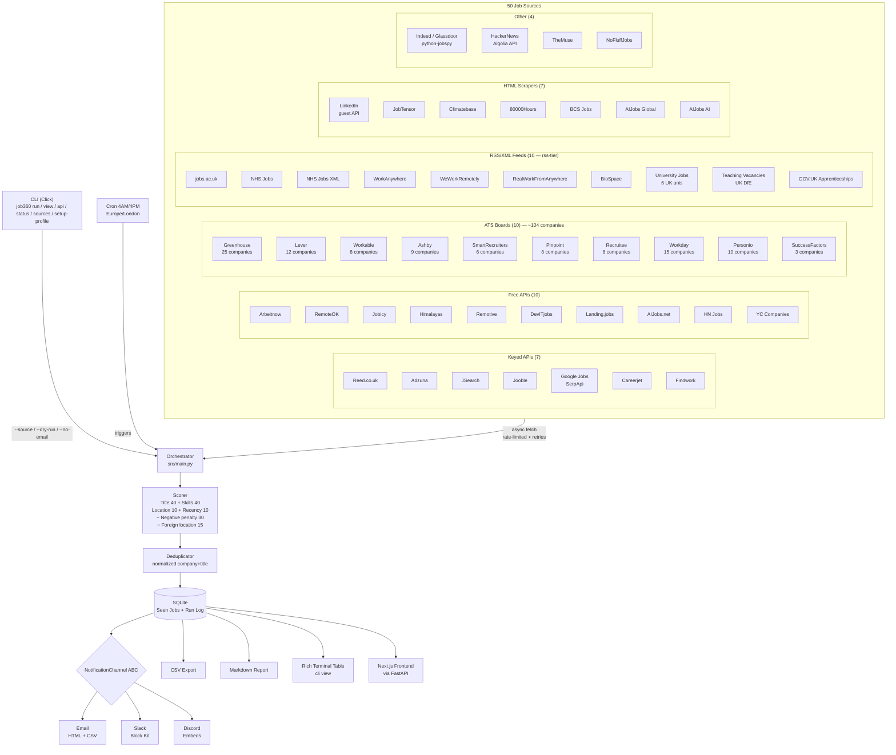

# Job360

Automated UK job search system supporting any professional domain. Aggregates jobs from 50 sources, scores them 0-100 against your profile (CV, LinkedIn, GitHub, or manual preferences), deduplicates across sources, and delivers results via CLI, email, Slack, Discord, CSV, Rich terminal table, and a Next.js frontend (backed by FastAPI). Without a profile, defaults to AI/ML job search.

### API docs (auto-generated)

Once the backend is running (`cd backend && python main.py`), interactive API docs are served at **http://localhost:8000/docs** (Swagger UI) and **http://localhost:8000/redoc** (ReDoc). Both are generated from the FastAPI route decorators + Pydantic models — no separate maintenance.

## Architecture


```mermaid
flowchart TD
    CLI["CLI (Click)\njob360 run / view / api / status / sources / setup-profile"]
    Cron["Cron 4AM/4PM\nEurope/London"]

    subgraph Sources["50 Job Sources"]
        direction LR
        subgraph Keyed["Keyed APIs (7)"]
            A1[Reed.co.uk]
            A2[Adzuna]
            A3[JSearch]
            A4[Jooble]
            A5[Google Jobs\nSerpApi]
            A6[Careerjet]
            A7[Findwork]
        end
        subgraph Free["Free APIs (10)"]
            B1[Arbeitnow]
            B2[RemoteOK]
            B3[Jobicy]
            B4[Himalayas]
            B5[Remotive]
            B6[DevITjobs]
            B7[Landing.jobs]
            B8[AIJobs.net]
            B9[HN Jobs]
            B10[YC Companies]
        end
        subgraph ATS["ATS Boards (10) — ~104 companies"]
            C1[Greenhouse\n25 companies]
            C2[Lever\n12 companies]
            C3[Workable\n8 companies]
            C4[Ashby\n9 companies]
            C5[SmartRecruiters\n6 companies]
            C6[Pinpoint\n8 companies]
            C7[Recruitee\n8 companies]
            C8[Workday\n15 companies]
            C9[Personio\n10 companies]
            C10[SuccessFactors\n3 companies]
        end
        subgraph RSS["RSS/XML Feeds (10 — rss-tier)"]
            D1[jobs.ac.uk]
            D2[NHS Jobs]
            D3[NHS Jobs XML]
            D4[WorkAnywhere]
            D5[WeWorkRemotely]
            D6[RealWorkFromAnywhere]
            D7[BioSpace]
            D8[University Jobs\n6 UK unis]
            D9[Teaching Vacancies\nUK DfE]
            D10[GOV.UK Apprenticeships]
        end
        subgraph Scrapers["HTML Scrapers (7)"]
            E1[LinkedIn\nguest API]
            E2[JobTensor]
            E3[Climatebase]
            E4[80000Hours]
            E5[BCS Jobs]
            E6[AIJobs Global]
            E7[AIJobs AI]
        end
        subgraph Other["Other (4)"]
            F1[Indeed / Glassdoor\npython-jobspy]
            F2[HackerNews\nAlgolia API]
            F3[TheMuse]
            F4[NoFluffJobs]
        end
    end

    CLI -->|"--source / --dry-run / --no-email"| Orchestrator["Orchestrator\nsrc/main.py"]
    Cron -->|triggers| Orchestrator
    Sources -->|async fetch\nrate-limited + retries| Orchestrator
    Orchestrator --> Scorer["Scorer\nTitle 40 + Skills 40\nLocation 10 + Recency 10\n− Negative penalty 30\n− Foreign location 15"]
    Scorer --> Dedup[Deduplicator\nnormalized company+title]
    Dedup --> DB[(SQLite\nSeen Jobs + Run Log)]

    DB --> Channels{NotificationChannel ABC}
    Channels --> Email[Email\nHTML + CSV]
    Channels --> Slack[Slack\nBlock Kit]
    Channels --> Discord[Discord\nEmbeds]

    DB --> CSV[CSV Export]
    DB --> Report[Markdown Report]
    DB --> RichTable[Rich Terminal Table\ncli view]
    DB --> NextJS[Next.js Frontend\nvia FastAPI]
```

## Features

### Job Sources (50, post-Batch-3 rotation)
- **7 keyed APIs**: Reed, Adzuna, JSearch, Jooble, Google Jobs (SerpApi), Careerjet, Findwork — skip gracefully if no API key set
- **9 free APIs**: Arbeitnow, RemoteOK, Jobicy, Himalayas, Remotive, DevITjobs, Landing.jobs, AIJobs.net, HN Jobs — work without any configuration (YC Companies dropped in Batch 3 — covered by HN Jobs + Ashby)
- **12 ATS boards**: Greenhouse, Lever, Workable, Ashby, SmartRecruiters, Pinpoint, Recruitee, Workday, Personio, SuccessFactors, Rippling, Comeet — ~268 hand-curated company slugs across 12 platforms (Batch-3 expansion from 104 → 268)
- **10 RSS/XML feeds (rss-tier)**: jobs.ac.uk, NHS Jobs, NHS Jobs XML, WorkAnywhere, WeWorkRemotely, RealWorkFromAnywhere, BioSpace, University Jobs (6 UK unis), Teaching Vacancies (UK DfE), GOV.UK Apprenticeships — Batch-3 added the last three; FindAJob dropped (Adzuna already wraps the same feed). Two of these (`teaching_vacancies`, `gov_apprenticeships`) live under `apis_free/` but declare `category = "rss"` for the 15-min scheduler tier.
- **7 HTML scrapers**: LinkedIn (guest API), JobTensor, Climatebase, 80000Hours (Algolia API), BCS Jobs, AIJobs Global, AIJobs AI
- **4 other**: Indeed/Glassdoor (via python-jobspy, optional), HackerNews (Algolia "Who is Hiring"), TheMuse, NoFluffJobs (Nomis UK-GOV stats source dropped — was macro statistics, not a jobs feed)

### Profile System (any domain)
- **CV parsing**: Upload PDF or DOCX, extracts skills, job titles, education, certifications
- **LinkedIn enrichment**: Import a LinkedIn profile PDF (profile → More → Save to PDF) — positions, skills, education
- **GitHub enrichment**: Fetch public repos, infer skills from languages and topics
- **Interactive preferences**: Target titles, skills, locations, salary range, work arrangement
- **Dynamic keywords**: Profile generates personalised search queries, relevance keywords, and scoring criteria
- **Backward compatible**: No profile = same AI/ML search as before

### Scoring (0-100)
- **Title match** (0-40 pts) — exact match = 40, partial = 20, keyword overlap = 5 each
- **Skill match** (0-40 pts) — primary skills 3pts, secondary 2pts, tertiary 1pt (capped at 40)
- **Location** (0-10 pts) — target UK location = 10, remote = 8
- **Recency** (0-10 pts) — 0-1 days = 10, 1-3 days = 8, 3-5 days = 6, 5-7 days = 4, 7+ days = 0
- **Negative keyword penalty** (-30 pts) — titles matching irrelevant roles (sales, nursing, etc.) are penalised
- **Foreign location penalty** (-15 pts) — jobs with non-UK locations (US states, EU countries, etc.) are penalised
- **Experience level detection** — parses Senior, Lead, Junior, Principal, etc. from title

### Data Quality
- **HTML entity decoding** — cleans `&amp;`, `&lt;`, etc. from job descriptions
- **Company name cleaning** — strips suffixes like "Ltd", "Inc", "Limited", and region tags like "UK", "EMEA" for consistent dedup
- **Salary outlier filtering** — ignores unrealistic salary values (<10k or >500k)

### Notifications (extensible)
- **Email** — HTML digest with top jobs, scores, apply links, and CSV attachment via Gmail SMTP
- **Slack** — rich Block Kit message with top 10 jobs via webhook
- **Discord** — embed message with top 10 jobs via webhook
- **NotificationChannel ABC** — add a new channel (e.g. Telegram) by implementing one class

### CLI (Click)
- `run` — full pipeline with `--source`, `--dry-run`, `--log-level`, `--db-path`, `--no-email` options
- `view` — Rich terminal table with `--hours`, `--min-score`, `--source`, `--visa-only`, `--db-path` filters
- `setup-profile` — interactive profile wizard with `--cv`, `--linkedin`, `--github` options
- `api` — start the FastAPI backend server (consumed by the Next.js frontend)
- `status` — show last run stats from database
- `sources` — list all 48 available sources

### Frontend (Next.js + FastAPI)
- Next.js 16 + React 19 + Tailwind 4 + shadcn 4 at `frontend/`
- Talks to FastAPI (`backend/src/api/`) over HTTP — **46 routes across 11 modules** (health, auth, actions, jobs, profile, search, pipeline, channels, notifications, notification_rules, runs)
- Job list with filters, score radar, time buckets, dedup-group viewer (Step 3)
- Profile setup: CV upload, LinkedIn profile PDF import, GitHub username, preferences form, version history + per-version diff drawer (Step 3)
- Application pipeline Kanban board with timeline drawer + notes editor + filter panel + confirmation dialogs (Step 3)
- `/settings` landing with Channels / Notifications / Account tabs (Step 3): per-channel rule editor (score thresholds, instant vs digest, quiet hours), password change, email change, soft-delete account
- `/notifications` ledger viewer — paginated history with channel + status + time-range filters (Step 3)
- Auth: register / login / logout cookie sessions, `?next=` post-login redirect with open-redirect guard

### Infrastructure
- **Deduplication** — same job from different sources merged by normalised company+title
- **Persistent tracking** — SQLite database prevents duplicate notifications across runs
- **Visa flagging** — automatically flags jobs mentioning visa/sponsorship keywords
- **Async rate limiting** — per-source concurrency + delay (configurable in settings.py)
- **Retry logic** — 3 attempts with exponential backoff (1s, 2s, 4s) + 30s timeout per request, 120s timeout per source
- **Cron scheduling** — `cron_setup.sh` sets up 4AM/4PM UK time (Europe/London)
- **Logging** — rotating file handler (5MB max, 3 backups) + console output
- **Dry-run mode** — fetch and score without writing to DB or sending notifications
- **Auto-purge** — jobs older than 30 days are automatically deleted on each run
- **Split requirements** — prod deps in `backend/pyproject.toml`, dev/test in `requirements-dev.txt`
- **Hardened setup** — Python 3.9+ version check, idempotent installs, .env validation

### Testing (1,154 passing — post-Step-3 close-out at origin/main `7194d0e`)

| Test file | Count | What it covers |
|-----------|-------|----------------|
| `test_sources.py` | 71 | All 50 sources with mocked HTTP |
| `test_profile.py` | 55 | CV parser, preferences, keyword generator, JobScorer |
| `test_linkedin_github.py` | 58 | LinkedIn PDF parsing (section-split + LLM), GitHub API enrichment |
| `test_scorer.py` | 53 | Scoring algorithm, penalties, recency tiers, edge cases |
| `test_time_buckets.py` | 33 | Time bucket grouping logic |
| `test_models.py` | 21 | Job dataclass, normalisation, company cleaning |
| `test_notifications.py` | 19 | Email, Slack, Discord sending |
| `test_deduplicator.py` | 13 | Cross-source dedup logic |
| `test_main.py` | 12 | Orchestrator integration |
| `test_cli.py` | 11 | CLI commands + options + SOURCE_REGISTRY assertions |
| `test_database.py` | 9 | SQLite operations, migrations, source history |
| `test_api.py` | 9 | FastAPI endpoints (health, jobs, actions, profile, search, pipeline) |
| `test_llm_provider.py` | 8 | Multi-provider LLM client for CV parsing |
| `test_notification_base.py` | 7 | ABC, format_salary, channel discovery |
| `test_setup.py` | 6 | setup.sh validation |
| `test_reports.py` | 6 | Markdown + HTML report generation |
| `test_rate_limiter.py` | 5 | Async rate limiter (acquire/release, concurrency, delay) |
| `test_cron.py` | 5 | cron_setup.sh validation |
| `test_cli_view.py` | 5 | Rich terminal table viewer |
| `test_csv_export.py` | 4 | CSV export format |

## Quick Start

```bash
# 1. Clone and setup
git clone https://github.com/Ranjith36963/job360.git
cd job360
bash setup.sh

# 2. Configure API keys (optional — free sources work without any keys)
nano .env

# 3. Run job search
source venv/bin/activate
python -m src.cli run

# 4. Single source / dry run
python -m src.cli run --source arbeitnow
python -m src.cli run --dry-run --log-level DEBUG

# 5. Set up a personalised profile
python -m src.cli setup-profile --cv path/to/cv.pdf
python -m src.cli setup-profile --cv cv.pdf --linkedin linkedin-profile.pdf --github yourusername

# 6. View results in terminal
python -m src.cli view --hours 24 --min-score 50

# 7. Start the API + frontend
python -m src.cli api            # FastAPI on :8000
# (in another terminal) cd frontend && npm run dev   # Next.js on :3000

# 8. Schedule (optional)
bash cron_setup.sh
```

## CLI Usage

```bash
# Full pipeline — fetch from all 50 sources, score, deduplicate, notify
python -m src.cli run

# Single source only
python -m src.cli run --source arbeitnow
python -m src.cli run --source reed

# Dry run — fetch and score, skip DB writes and notifications
python -m src.cli run --dry-run

# Skip email notifications
python -m src.cli run --no-email

# Debug logging
python -m src.cli run --log-level DEBUG

# Custom database path
python -m src.cli run --db-path /tmp/test.db

# Combine options
python -m src.cli run --source greenhouse --dry-run --log-level DEBUG

# Set up user profile (personalise for any domain)
python -m src.cli setup-profile --cv path/to/cv.pdf
python -m src.cli setup-profile --cv cv.pdf --linkedin linkedin-profile.pdf
python -m src.cli setup-profile --cv cv.pdf --github yourusername
python -m src.cli setup-profile --linkedin linkedin-profile.pdf --github user

# View jobs in Rich terminal table
python -m src.cli view
python -m src.cli view --hours 24 --min-score 50
python -m src.cli view --source reed --visa-only
python -m src.cli view --db-path /tmp/test.db

# Start the FastAPI backend (consumed by the Next.js frontend)
python -m src.cli api

# Show last run stats
python -m src.cli status

# List all available sources
python -m src.cli sources
```

## API Key Setup

| Source | Signup | ENV Variable |
|--------|--------|-------------|
| Reed.co.uk | [reed.co.uk/developers](https://www.reed.co.uk/developers/jobseeker) | `REED_API_KEY` |
| Adzuna | [developer.adzuna.com](https://developer.adzuna.com/) | `ADZUNA_APP_ID`, `ADZUNA_APP_KEY` |
| JSearch | [rapidapi.com/jsearch](https://rapidapi.com/letscrape-6bRBa3QguO5/api/jsearch) | `JSEARCH_API_KEY` |
| Jooble | [jooble.org/api](https://jooble.org/api/about) | `JOOBLE_API_KEY` |
| Google Jobs | [serpapi.com](https://serpapi.com/) | `SERPAPI_KEY` |
| Careerjet | [careerjet.com/partners](https://www.careerjet.com/partners/) | `CAREERJET_AFFID` |
| Findwork | [findwork.dev](https://findwork.dev/) | `FINDWORK_API_KEY` |
| GitHub | [github.com/settings/tokens](https://github.com/settings/tokens) | `GITHUB_TOKEN` (optional, for profile enrichment) |
| Gmail | [Google App Passwords](https://myaccount.google.com/apppasswords) | `SMTP_EMAIL`, `SMTP_PASSWORD`, `NOTIFY_EMAIL` |
| Slack | [Slack Webhooks](https://api.slack.com/messaging/webhooks) | `SLACK_WEBHOOK_URL` |
| Discord | [Discord Webhooks](https://discord.com/developers/docs/resources/webhook) | `DISCORD_WEBHOOK_URL` |

**Free sources (no key needed)**: Arbeitnow, RemoteOK, Jobicy, Himalayas, Remotive, DevITjobs, Landing.jobs, AIJobs.net, HN Jobs, LinkedIn, Greenhouse, Lever, Workable, Ashby, SmartRecruiters, Pinpoint, Recruitee, Workday, Personio, SuccessFactors, Rippling, Comeet, jobs.ac.uk, NHS Jobs, NHS Jobs XML, WorkAnywhere, WeWorkRemotely, RealWorkFromAnywhere, BioSpace, University Jobs, Teaching Vacancies, GOV.UK Apprenticeships, JobTensor, Climatebase, 80000Hours, BCS Jobs, AIJobs Global, AIJobs AI, Indeed/Glassdoor (if python-jobspy installed), HackerNews, TheMuse, NoFluffJobs — 43 sources work without any API keys.

## Scoring Algorithm

| Component | Points | How it works |
|-----------|--------|-------------|
| **Title match** | 0-40 | Exact match to target titles = 40pts. Partial match = 20pts. Keyword overlap = 5pts each |
| **Skill match** | 0-40 | Primary skills = 3pts each. Secondary = 2pts each. Tertiary = 1pt each. Capped at 40 |
| **Location** | 0-10 | Target UK location = 10pts. Remote = 8pts |
| **Recency** | 0-10 | Posted 0-1 days ago = 10pts, 1-3 days = 8pts, 3-5 days = 6pts, 5-7 days = 4pts, 7+ days = 0pts |
| **Negative keyword** | -30 | Titles matching irrelevant roles (sales engineer, recruiter, nurse, etc.) get a 30-point penalty |
| **Foreign location** | -15 | Non-UK locations (US states, EU countries, etc.) get a 15-point penalty |

**Total: 0-100** — minimum score threshold is 30 (configurable in `settings.py`)

When a user profile is loaded, the scorer uses dynamic keywords from the profile instead of the default AI/ML keywords.

## Notification Channels

The notification system uses an abstract base class (`NotificationChannel` in `backend/src/services/notifications/base.py`) with auto-discovery:

```
NotificationChannel (ABC)
├── EmailChannel      — configured if SMTP_EMAIL + SMTP_PASSWORD + NOTIFY_EMAIL set
├── SlackChannel      — configured if SLACK_WEBHOOK_URL set
└── DiscordChannel    — configured if DISCORD_WEBHOOK_URL set
```

`get_configured_channels()` returns only channels whose env vars are set. The orchestrator loops over them:

```python
for channel in get_configured_channels():
    await channel.send(new_jobs, stats)
```

**Adding a new channel** (e.g. Telegram): create `backend/src/services/notifications/telegram_notify.py`, implement `NotificationChannel`, and register it in `get_all_channels()`.

## Adding a New Job Source

1. Create `backend/src/sources/yoursource.py`, extend `BaseJobSource`
2. Implement `async fetch_jobs() -> list[Job]`
3. Use `self.relevance_keywords` and `self.job_titles` for filtering (not direct imports)
4. If custom `__init__`, accept `search_config=None` and pass to `super().__init__(session, search_config=search_config)`
5. Register in `SOURCE_REGISTRY` dict in `backend/src/main.py`
6. Add to `_build_sources()` list in `backend/src/main.py` (passing `search_config=sc`)
7. Add rate limit entry in `RATE_LIMITS` dict in `backend/src/core/settings.py`
8. Add mocked tests in `backend/tests/test_sources.py`
9. Update the `len(SOURCE_REGISTRY) == N` assertion and expected source set in `backend/tests/test_cli.py`
10. If keyed: add env var to `backend/src/core/settings.py` and `.env.example`

## Configuration

### Default Keywords (`backend/src/core/keywords.py`)
- **25 job titles**: AI Engineer, ML Engineer, Machine Learning Engineer, GenAI Engineer, Generative AI Engineer, LLM Engineer, NLP Engineer, Data Scientist, MLOps Engineer, AI/ML Engineer, Deep Learning Engineer, Computer Vision Engineer, RAG Engineer, AI Solutions Engineer, AI Research Engineer, Applied ML Engineer, Python AI Developer, AI Researcher, ML Scientist, Machine Learning Scientist, AI Platform Engineer, AI Infrastructure Engineer, Conversational AI Engineer, Applied Scientist, Research Scientist
- **15 primary skills** (3pts each): Python, PyTorch, TensorFlow, LangChain, RAG, LLM, Generative AI, Hugging Face, Transformers, OpenAI, NLP, Deep Learning, Neural Networks, Computer Vision, Prompt Engineering
- **17 secondary skills** (2pts each): Scikit-learn, Keras, AWS, SageMaker, Bedrock, Docker, Kubernetes, FastAPI, ChromaDB, FAISS, OpenSearch, Redis, pgvector, Gemini, Agentic AI, LLM fine-tuning, Fine-tuning
- **11 tertiary skills** (1pt each): CI/CD, MLflow, Git, Linux, n8n, Data Pipelines, ETL, Feature Engineering, S3, CloudWatch, Machine Learning
- **24 UK locations** + Remote/Hybrid
- **60 negative title keywords** across 12 categories (sales, IT ops, healthcare, legal, finance, etc.)
- **LLM-only CV parsing** via `backend/src/services/profile/llm_provider.py` (multi-provider: Gemini, Groq, Cerebras with free-tier fallback). The earlier 391-entry `KNOWN_SKILLS` regex set was removed in commit 3ba1342.

### ATS Companies (`backend/src/core/companies.py`)
- **Greenhouse** (25): DeepMind, Monzo, Deliveroo, Darktrace, Stability AI, Anthropic, Graphcore, Wayve, PolyAI, Synthesia, Wise, Snyk, Stripe, Cloudflare, Databricks, Dataiku, Ocado Technology, Tractable, Paddle, Harness, Isomorphic Labs, Speechmatics, Onfido, Oxford Nanopore, Bloomberg
- **Lever** (12): Mistral, Healx, Palantir, Spotify, ZOE, Tractable, Helsing, SecondMind, MosaicML, Faculty, Dyson, Five AI
- **Workable** (8): BenevolentAI, Exscientia, Oxa, Cervest, Hugging Face, Labelbox, Runway, Adept
- **Ashby** (9): Anthropic, Cohere, OpenAI, Improbable, Synthesia, Multiverse, ElevenLabs, Perplexity, Anyscale
- **SmartRecruiters** (6): Wise, Revolut, Checkout.com, AstraZeneca, Samsung R&D UK, Booking
- **Pinpoint** (8): MoneySuperMarket, Bulb, Starling Bank, Octopus Energy, Faculty, Arm, Sky, Tesco Technology
- **Recruitee** (8): Peak AI, Satalia, Speech Graphics, Signal AI, Eigen Technologies, Causaly, Kheiron Medical, PolyAI
- **Workday** (15): AstraZeneca, NVIDIA, Shell, Roche, Novartis, Cisco, Dell, Intel, Unilever, HSBC, Barclays, Lloyds Banking Group, Rolls-Royce, GSK, Jaguar Land Rover
- **Personio** (10): Celonis, Trade Republic, Sennder, Contentful, Personio, Forto, Taxfix, Wonderkind, Airfocus, Heydata
- **SuccessFactors** (3): BAE Systems, QinetiQ, Thales UK

## Project Structure

```
job360/
├── backend/src/
│   ├── main.py                  # Central orchestrator (run_search, SOURCE_REGISTRY)
│   ├── cli.py                   # Click CLI (run, view, api, status, sources, setup-profile)
│   ├── cli_view.py              # Rich terminal table viewer (time-bucketed)
│   ├── models.py                # Job dataclass with company normalisation
│   ├── api/                     # FastAPI backend consumed by the Next.js frontend
│   ├── core/                     # phase-4 rename of config/
│   │   ├── settings.py          # Env vars, rate limits, timeouts, thresholds
│   │   ├── keywords.py          # Default AI/ML keywords (KNOWN_SKILLS regex removed in commit 3ba1342)
│   │   ├── companies.py         # ATS company slugs (~268 across 12 platforms post-Batch-3)
│   │   ├── skill_synonyms.py    # 493-entry alias → canonical skill dict (Pillar 2.3)
│   │   ├── fx.py                # 18-currency → GBP rates (Pillar 2.9)
│   │   └── tenancy.py           # DEFAULT_TENANT_ID for legacy rows
│   ├── services/                 # phase-4 merge of filters/ + notifications/ + profile/
│   │   ├── skill_matcher.py     # JobScorer (legacy 4-comp + Pillar-2 7-dim path)
│   │   ├── scoring_dimensions.py # seniority / salary / visa / workplace
│   │   ├── deduplicator.py      # 4-layer dedup (exact → RapidFuzz → TF-IDF → embedding)
│   │   ├── domain_classifier.py # source routing by professional domain
│   │   ├── salary.py            # cadence → annual GBP normalizer
│   │   ├── prefilter.py         # 3-stage cascade (location → experience → skills)
│   │   ├── feed.py              # FeedService SSOT for per-user feed rows
│   │   ├── ghost_detection.py   # active → possibly_stale → likely_stale → confirmed_expired
│   │   ├── circuit_breaker.py   # CLOSED/HALF_OPEN/OPEN per source + registry
│   │   ├── conditional_cache.py # FIFO cache for ETag / Last-Modified validators
│   │   ├── scheduler.py         # TieredScheduler — per-tier polling cadence
│   │   ├── retrieval.py         # RRF + cross-encoder rerank + hybrid mode
│   │   ├── embeddings.py        # all-MiniLM-L6-v2 encoder (lazy-imported)
│   │   ├── vector_index.py      # ChromaDB persistent collection
│   │   ├── job_enrichment.py    # async enrich_job() + DB cache
│   │   ├── job_enrichment_schema.py # 18-field Pydantic schema for LLM output
│   │   ├── auth/                # passwords.py (argon2id) + sessions.py (signed cookies)
│   │   ├── channels/            # crypto.py (Fernet) + dispatcher.py (Step-3 rule consultation, timezone-aware quiet hours)
│   │   ├── notifications/       # base ABC + email/slack/discord channels + report_generator
│   │   └── profile/             # cv_parser, llm_provider, linkedin_parser, github_enricher, keyword_generator, models, preferences, storage (+ schemas, layout, dep_file_parser, skill_normalizer, skill_tiering, skill_entry, dependency_map)
│   ├── repositories/             # phase-4 rename of storage/
│   │   ├── database.py          # Async SQLite (15 migrations applied; jobs + run_log + users + sessions + user_feed + notification_ledger + user_channels + user_profiles + user_profile_versions + job_enrichment + job_embeddings + score_dimensions + notification_rules + user_notification_digests + application_history)
│   │   └── csv_export.py        # CSV export per run
│   ├── api/
│   │   ├── main.py              # FastAPI app (CORS, lifespan, route registration)
│   │   ├── auth_deps.py         # require_user / optional_user dependencies
│   │   ├── dependencies.py      # get_db() + save_upload_to_temp()
│   │   ├── models.py            # Pydantic request/response (mirrors frontend types.ts)
│   │   └── routes/              # 11 modules: health, auth, actions, jobs, profile, search, pipeline, channels, notifications, notification_rules, runs (46 endpoints)
│   ├── sources/
│   │   ├── base.py              # Abstract base + retry + rate-limit + ETag conditional fetch (opt-in)
│   │   └── apis_keyed/, apis_free/, ats/, feeds/, scrapers/, other/   # 49 source files split by category, 50 SOURCE_REGISTRY entries
│   ├── workers/
│   │   ├── tasks.py             # 7 ARQ tasks: score_and_ingest, send_notification, mark_ledger_sent_task, mark_ledger_failed_task, nightly_ghost_sweep, send_daily_digest, enrich_job_task
│   │   └── settings.py          # WorkerSettings + cron_jobs registration
│   └── utils/
│       ├── logger.py            # Rotating file + console logging
│       ├── rate_limiter.py      # Async semaphore + delay rate limiter
│       └── time_buckets.py      # Time bucket grouping for CLI view
├── backend/tests/                       # 1,154 passing (post-Step-3 close-out) across 60+ files
│   ├── conftest.py              # Shared fixtures (sample jobs)
│   └── test_*.py                # 60+ test modules
├── backend/data/                        # Exports, reports, logs, jobs.db, ChromaDB (gitignored)
├── backend/pyproject.toml             # Production dependencies + dev/semantic extras
├── backend/migrations/                # 15 forward+reverse SQL migration pairs (0000 baseline → 0014 application_history) + runner.py
├── .env.example                 # Template for API keys and webhooks
├── setup.sh                     # Setup script (Python 3.9+ check, venv, deps)
└── cron_setup.sh                # Cron scheduling (4AM/4PM Europe/London)
```

## Testing

```bash
# Run all 1,154 passing (post-Step-3 close-out)
python -m pytest backend/tests/ -v

# Run specific test file
python -m pytest backend/tests/test_scorer.py -v

# Run with output
python -m pytest backend/tests/ -v -s
```

All 1,154 passing (post-Step-3 close-out) pass. Every source is tested with mocked HTTP responses (aioresponses). No network access required. 3 tests skip on Windows (bash-only tests for setup.sh and cron_run.sh).

## Output

Each run produces:

| Output | Location | Description |
|--------|----------|-------------|
| CSV | `backend/data/exports/jobs_YYYYMMDD_HHMMSS.csv` | Full job data with scores |
| Markdown | `backend/data/reports/report_YYYYMMDD_HHMMSS.md` | Ranked job tables |
| Rich table | Terminal (`python -m src.cli view`) | Time-bucketed terminal table with filters |
| Email | Inbox | HTML digest with top jobs + CSV attachment |
| Slack | Channel | Block Kit message with top 10 jobs |
| Discord | Channel | Embed message with top 10 jobs |
| Frontend | `http://localhost:3000` | Next.js UI (requires FastAPI on `:8000`) |
| Console | Terminal | Time-bucketed summary of new jobs found |
| Logs | `backend/data/logs/job360.log` | Rotating log file (5MB, 3 backups) |
