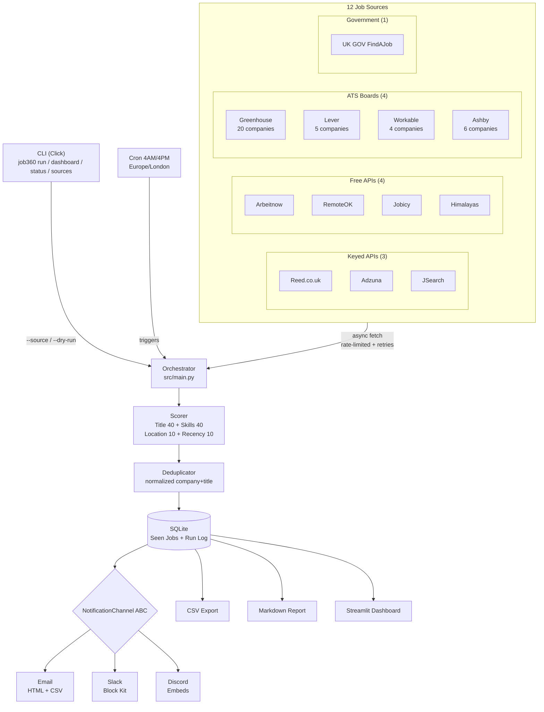

# Job360

Automated UK AI/ML job search system. Aggregates jobs from 12 sources, scores them 0-100 against your CV profile, deduplicates across sources, and delivers results via CLI, email, Slack, Discord, CSV, and a Streamlit dashboard.

## Architecture



## Features

### Job Sources (12)
- **3 keyed APIs**: Reed, Adzuna, JSearch — skip gracefully if no API key set
- **4 free APIs**: Arbeitnow, RemoteOK, Jobicy, Himalayas — work without any configuration
- **4 ATS boards**: Greenhouse (20 companies), Lever (5), Workable (4), Ashby (6) — 35 companies total
- **1 government feed**: UK GOV FindAJob RSS

### Scoring (0-100)
- **Title match** (0-40 pts) — exact match = 40, partial = 20, keyword overlap = 5 each
- **Skill match** (0-40 pts) — primary skills 3pts, secondary 2pts, tertiary 1pt (capped at 40)
- **Location** (0-10 pts) — target UK location = 10, remote = 8
- **Recency** (0-10 pts) — 0-1 days = 10, 1-3 days = 8, 3-5 days = 6, 5-7 days = 4, 7+ days = 0

### Notifications (extensible)
- **Email** — HTML digest with top jobs, scores, apply links, and CSV attachment via Gmail SMTP
- **Slack** — rich Block Kit message with top 10 jobs via webhook
- **Discord** — embed message with top 10 jobs via webhook
- **NotificationChannel ABC** — add a new channel (e.g. Telegram) by implementing one class

### CLI (Click)
- `run` — full pipeline with `--source`, `--dry-run`, `--log-level`, `--db-path` options
- `dashboard` — launch Streamlit web UI
- `status` — show last run stats from database
- `sources` — list all 12 available sources

### Dashboard (Streamlit)
- Sidebar filters: text search, score range, source, location, visa sponsorship
- KPI row: total jobs, avg score, top score, visa sponsors, sources count
- Score distribution histogram + jobs by source pie chart
- Sortable job listings table with clickable apply links
- CSV export button
- Run history with timeline chart
- Previous exports file browser
- Trigger new search from UI

### Infrastructure
- **Deduplication** — same job from different sources merged by normalised company+title
- **Persistent tracking** — SQLite database prevents duplicate notifications across runs
- **Visa flagging** — automatically flags jobs mentioning visa/sponsorship keywords
- **Async rate limiting** — per-source concurrency + delay (configurable in settings.py)
- **Retry logic** — 3 attempts with exponential backoff (1s, 2s, 4s) + 30s timeout
- **Cron scheduling** — `cron_setup.sh` sets up 4AM/4PM UK time (Europe/London)
- **Logging** — rotating file handler (5MB max, 3 backups) + console output
- **Dry-run mode** — fetch and score without writing to DB or sending notifications
- **Split requirements** — prod deps in `requirements.txt`, dev/test in `requirements-dev.txt`
- **Hardened setup** — Python 3.9+ version check, idempotent installs, .env validation

### Testing (108 tests)

| Test file | Count | What it covers |
|-----------|-------|----------------|
| `test_scorer.py` | 16 | Scoring algorithm, recency tiers, edge cases |
| `test_notifications.py` | 19 | Email, Slack, Discord sending |
| `test_sources.py` | 14 | All 12 sources with mocked HTTP |
| `test_deduplicator.py` | 7 | Cross-source dedup logic |
| `test_main.py` | 7 | Orchestrator integration |
| `test_notification_base.py` | 7 | ABC, format_salary, channel discovery |
| `test_database.py` | 6 | SQLite operations |
| `test_models.py` | 6 | Job dataclass, normalisation |
| `test_reports.py` | 6 | Markdown + HTML report generation |
| `test_setup.py` | 6 | setup.sh validation |
| `test_cli.py` | 5 | CLI commands + options |
| `test_cron.py` | 5 | cron_setup.sh validation |
| `test_csv_export.py` | 4 | CSV export format |

## What's Not Done Yet

- **Live API results** — the system runs end-to-end without errors but needs to be executed on a machine with internet access to fetch real job listings. All 12 sources, retry logic, scoring, dedup, and notifications are verified with mocks (108 tests passing)

## Quick Start

```bash
# 1. Clone and setup
git clone https://github.com/Ranjith36963/enterprise-mcp-hub.git
cd enterprise-mcp-hub
bash setup.sh

# 2. Configure API keys
nano .env

# 3. Run job search
source venv/bin/activate
python -m src.cli run

# 4. Single source / dry run
python -m src.cli run --source arbeitnow
python -m src.cli run --dry-run --log-level DEBUG

# 5. Launch dashboard
python -m src.cli dashboard

# 6. Schedule (optional)
bash cron_setup.sh
```

## CLI Usage

```bash
# Full pipeline — fetch from all sources, score, deduplicate, notify
python -m src.cli run

# Single source only
python -m src.cli run --source arbeitnow
python -m src.cli run --source reed

# Dry run — fetch and score, skip DB writes and notifications
python -m src.cli run --dry-run

# Debug logging
python -m src.cli run --log-level DEBUG

# Custom database path
python -m src.cli run --db-path /tmp/test.db

# Combine options
python -m src.cli run --source greenhouse --dry-run --log-level DEBUG

# Launch Streamlit dashboard
python -m src.cli dashboard

# Show last run stats
python -m src.cli status

# List all available sources
python -m src.cli sources
```

## API Key Setup

| Source | Signup | ENV Variable |
|--------|--------|-------------|
| Reed.co.uk | [reed.co.uk/developers](https://www.reed.co.uk/developers/jobseeker) | `REED_API_KEY` |
| Adzuna | [developer.adzuna.com](https://developer.adzuna.com/) | `ADZUNA_APP_ID`, `ADZUNA_APP_KEY` |
| JSearch | [rapidapi.com/jsearch](https://rapidapi.com/letscrape-6bRBa3QguO5/api/jsearch) | `JSEARCH_API_KEY` |
| Gmail | [Google App Passwords](https://myaccount.google.com/apppasswords) | `SMTP_EMAIL`, `SMTP_PASSWORD`, `NOTIFY_EMAIL` |
| Slack | [Slack Webhooks](https://api.slack.com/messaging/webhooks) | `SLACK_WEBHOOK_URL` |
| Discord | [Discord Webhooks](https://discord.com/developers/docs/resources/webhook) | `DISCORD_WEBHOOK_URL` |

**Free sources (no key needed)**: Arbeitnow, RemoteOK, Jobicy, Himalayas, Greenhouse, Lever, Workable, Ashby, FindAJob — the system works without any API keys, skipping keyed sources gracefully.

## Scoring Algorithm

| Component | Points | How it works |
|-----------|--------|-------------|
| **Title match** | 0-40 | Exact match to target titles (AI Engineer, ML Engineer, etc.) = 40pts. Partial match = 20pts. Keyword overlap = 5pts each |
| **Skill match** | 0-40 | Primary skills (Python, PyTorch, LangChain, etc.) = 3pts each. Secondary (Docker, AWS, SageMaker) = 2pts each. Tertiary (CI/CD, Git, MLflow) = 1pt each. Capped at 40 |
| **Location** | 0-10 | Target UK location (London, Manchester, etc.) = 10pts. Remote = 8pts |
| **Recency** | 0-10 | Posted 0-1 days ago = 10pts, 1-3 days = 8pts, 3-5 days = 6pts, 5-7 days = 4pts, 7+ days = 0pts |

**Total: 0-100** — minimum score threshold is 30 (configurable in `settings.py`)

## Notification Channels

The notification system uses an abstract base class (`NotificationChannel` in `src/notifications/base.py`) with auto-discovery:

```
NotificationChannel (ABC)
├── EmailChannel      — configured if SMTP_EMAIL + SMTP_PASSWORD + NOTIFY_EMAIL set
├── SlackChannel      — configured if SLACK_WEBHOOK_URL set
└── DiscordChannel    — configured if DISCORD_WEBHOOK_URL set
```

`get_configured_channels()` returns only channels whose env vars are set. The orchestrator loops over them:

```python
for channel in get_configured_channels():
    await channel.send(new_jobs, stats)
```

**Adding a new channel** (e.g. Telegram): create `src/notifications/telegram_notify.py`, implement `NotificationChannel`, and register it in `get_all_channels()`.

## Configuration

### Keywords (`src/config/keywords.py`)
- **17 job titles**: AI Engineer, ML Engineer, Machine Learning Engineer, Data Scientist, NLP Engineer, Computer Vision Engineer, Deep Learning Engineer, GenAI Engineer, LLM Engineer, AI/ML Engineer, Applied Scientist, Research Engineer, MLOps Engineer, AI Researcher, Prompt Engineer, AI Developer, Conversational AI Engineer
- **15 primary skills** (3pts each): Python, PyTorch, TensorFlow, LangChain, RAG, LLM, GenAI, Hugging Face, Transformers, OpenAI, NLP, Deep Learning, Neural Networks, Computer Vision, Prompt Engineering
- **17 secondary skills** (2pts each): Scikit-learn, Keras, AWS, SageMaker, Bedrock, Docker, Kubernetes, FastAPI, ChromaDB, FAISS, OpenSearch, Redis, pgvector, Gemini, Agentic AI, LLM fine-tuning, Fine-tuning
- **11 tertiary skills** (1pt each): CI/CD, MLflow, Git, Linux, n8n, Data Pipelines, ETL, Feature Engineering, S3, CloudWatch, Machine Learning
- **12 UK locations** + Remote/Hybrid

### Companies (`src/config/companies.py`)
- **Greenhouse** (20): DeepMind, Anthropic, OpenAI, Databricks, Scale AI, Cohere, Mistral, Stability AI, Inflection, Adept, Character AI, Runway, Jasper, Writer, Typeface, Mosaic ML, Together AI, Anyscale, Modal, Weights & Biases
- **Lever** (5): Hugging Face, Lightning AI, Replicate, Pinecone, Weaviate
- **Workable** (4): Synthesia, Faculty AI, PolyAI, Speechmatics
- **Ashby** (6): Vercel, Supabase, Resend, Neon, Turso, Axiom

## Project Structure

```
enterprise-mcp-hub/
├── src/
│   ├── main.py                  # Central orchestrator (run_search, SOURCE_REGISTRY)
│   ├── cli.py                   # Click CLI (run, dashboard, status, sources)
│   ├── models.py                # Job dataclass with company normalisation
│   ├── dashboard.py             # Streamlit web dashboard (filters, charts, KPIs)
│   ├── config/
│   │   ├── settings.py          # Env vars, rate limits, timeouts, thresholds
│   │   ├── keywords.py          # Job titles, skills (3 tiers), locations
│   │   └── companies.py         # ATS company slugs (35 companies)
│   ├── sources/
│   │   ├── base.py              # Abstract base with retry logic + rate limiting
│   │   ├── reed.py              # Reed.co.uk API (keyed)
│   │   ├── adzuna.py            # Adzuna API (keyed)
│   │   ├── jsearch.py           # JSearch/RapidAPI (keyed)
│   │   ├── arbeitnow.py         # Arbeitnow (free)
│   │   ├── remoteok.py          # RemoteOK (free)
│   │   ├── jobicy.py            # Jobicy (free)
│   │   ├── himalayas.py         # Himalayas (free)
│   │   ├── greenhouse.py        # Greenhouse ATS (20 companies)
│   │   ├── lever.py             # Lever ATS (5 companies)
│   │   ├── workable.py          # Workable ATS (4 companies)
│   │   ├── ashby.py             # Ashby ATS (6 companies)
│   │   └── findajob.py          # UK GOV FindAJob RSS
│   ├── filters/
│   │   ├── skill_matcher.py     # Scoring engine (0-100, 4 components)
│   │   └── deduplicator.py      # Cross-source dedup by normalised key
│   ├── notifications/
│   │   ├── base.py              # NotificationChannel ABC + auto-discovery
│   │   ├── email_notify.py      # Gmail SMTP (HTML + CSV attachment)
│   │   ├── slack_notify.py      # Slack Block Kit via webhook
│   │   ├── discord_notify.py    # Discord embeds via webhook
│   │   └── report_generator.py  # Markdown + HTML report generation
│   ├── storage/
│   │   ├── database.py          # Async SQLite (jobs + run_log tables)
│   │   └── csv_export.py        # CSV export per run
│   └── utils/
│       ├── logger.py            # Rotating file + console logging
│       └── rate_limiter.py      # Async semaphore + delay rate limiter
├── tests/                       # 108 tests across 13 files
│   ├── test_scorer.py           # 16 tests — scoring algorithm
│   ├── test_notifications.py    # 19 tests — email, slack, discord
│   ├── test_sources.py          # 14 tests — all 12 sources (mocked HTTP)
│   ├── test_deduplicator.py     # 7 tests — cross-source dedup
│   ├── test_main.py             # 7 tests — orchestrator integration
│   ├── test_notification_base.py # 7 tests — ABC, discovery, format_salary
│   ├── test_database.py         # 6 tests — SQLite operations
│   ├── test_models.py           # 6 tests — Job dataclass
│   ├── test_reports.py          # 6 tests — markdown + HTML reports
│   ├── test_setup.py            # 6 tests — setup.sh validation
│   ├── test_cli.py              # 5 tests — CLI commands
│   ├── test_cron.py             # 5 tests — cron_setup.sh validation
│   └── test_csv_export.py       # 4 tests — CSV export
├── data/                        # Exports, reports, logs (gitignored)
├── requirements.txt             # Production dependencies (8 packages)
├── requirements-dev.txt         # Dev/test dependencies (pytest, aioresponses)
├── .env.example                 # Template for API keys and webhooks
├── setup.sh                     # Setup script (Python 3.9+ check, venv, deps)
└── cron_setup.sh                # Cron scheduling (4AM/4PM Europe/London)
```

## Testing

```bash
# Run all 108 tests
python -m pytest tests/ -v

# Run specific test file
python -m pytest tests/test_scorer.py -v

# Run with output
python -m pytest tests/ -v -s
```

All 108 tests pass. Every source is tested with mocked HTTP responses (aioresponses). No network access required.

## Output

Each run produces:

| Output | Location | Description |
|--------|----------|-------------|
| CSV | `data/exports/jobs_YYYYMMDD_HHMMSS.csv` | Full job data with scores |
| Markdown | `data/reports/report_YYYYMMDD_HHMMSS.md` | Ranked job tables |
| Email | Inbox | HTML digest with top jobs + CSV attachment |
| Slack | Channel | Block Kit message with top 10 jobs |
| Discord | Channel | Embed message with top 10 jobs |
| Dashboard | `http://localhost:8501` | Interactive Streamlit UI |
| Console | Terminal | Summary of new jobs found |
| Logs | `data/logs/job360.log` | Rotating log file (5MB, 3 backups) |
